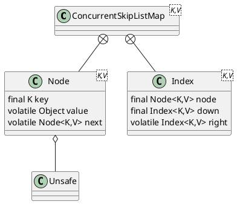

java.util.concurrent.ConcurrentSkipListMap

线程安全的有序的哈希表，适用于高并发的场景
- ConcurrentSkipListMap 通过跳表实现
- TreeMap 通过红黑树实现
- key是有序的，存取时间是log（N），和线程数几乎无关

## hierarchy
```
AbstractMap (java.util)
    ConcurrentSkipListMap (java.util.concurrent)
ConcurrentSkipListMap (java.util.concurrent)
    AbstractMap (java.util)
        Map (java.util)
    Cloneable (java.lang)
    ConcurrentNavigableMap (java.util.concurrent)
        ConcurrentMap (java.util.concurrent)
            Map (java.util)
        NavigableMap (java.util)
            SortedMap (java.util)
                Map (java.util)
```

## define


```java
public class ConcurrentSkipListMap<K,V> extends AbstractMap<K,V>
    implements ConcurrentNavigableMap<K,V>, Cloneable, Serializable {\
    
}
```

## fields
```java
    private static final Object BASE_HEADER = new Object();

    private transient volatile HeadIndex<K,V> head;
    final Comparator<? super K> comparator;

    /* Lazily initialized */
    private transient KeySet<K> keySet;
    private transient EntrySet<K,V> entrySet;
    private transient Values<V> values;
    private transient ConcurrentNavigableMap<K,V> descendingMap;
```

## methods

### put
```java
    public V put(K key, V value) {
        if (value == null)
            throw new NullPointerException();
        return doPut(key, value, false);
    }
```


## inner class

### Node
```java
    class Node<K,V> {
        final K key;
        volatile Object value;
        volatile Node<K,V> next;
        
        boolean casValue(Object cmp, Object val) {
            return UNSAFE.compareAndSwapObject(this, valueOffset, cmp, val);
        }
    }        
```

### Index
```java
    static class Index<K,V> {
        final Node<K,V> node;
        final Index<K,V> down;
        volatile Index<K,V> right;
    }    
```

### HeadIndex
```java
    static final class HeadIndex<K,V> extends Index<K,V> {
        final int level;
        HeadIndex(Node<K,V> node, Index<K,V> down, Index<K,V> right, int level) {
            super(node, down, right);
            this.level = level;
                 }
    }
```

## Unsafe
* compareAndSwapObject