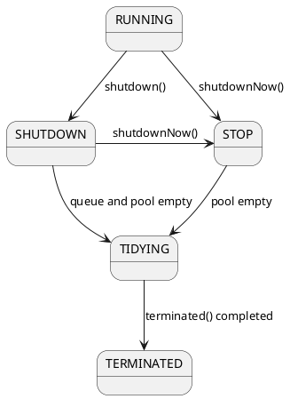
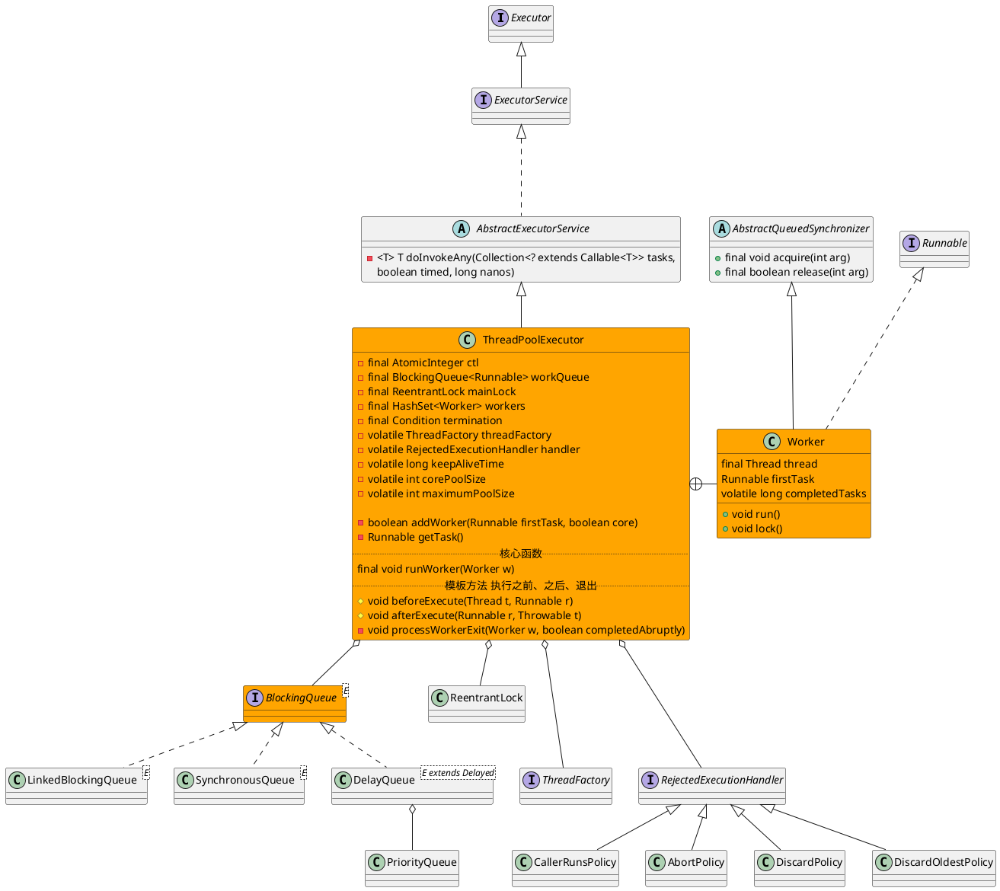
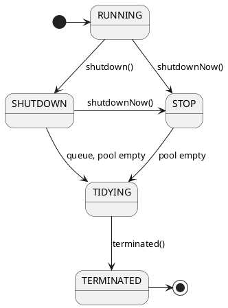
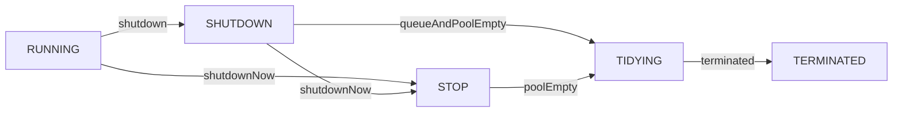

java.util.concurrent.ThreadPoolExecutor

* AtomicInteger
  * volatile
  * Unsafe 
* 工作队列
  * ArrayBlockingQueue 有界队列
  * LinkedBlockingQueue 
  * SynchronousQueue
* 拒绝策略
  * AbortPolicy 抛异常
  * CallerRunsPolicy 调用者线程执行
  * DiscardPolicy 直接抛弃
  * DiscardOldestPolicy 抛弃最早的
* 执行顺序
  * 是否大于core
  * 队列是否已满
  * 是否大于maxSize
  * rejectPolicy



## hierarchy
```
Executor
    ExecutorService
        AbstractExecutorService (java.util.concurrent)
            ThreadPoolExecutor (java.util.concurrent)
                ScheduledThreadPoolExecutor (java.util.concurrent)
                QuantumRenderer (com.sun.javafx.tk.quantum)
                ComInvoker in Win32ShellFolderManager2 (sun.awt.shell)
                MemoryAwareThreadPoolExecutor (org.jboss.netty.handler.execution)
                BrokerFixedThreadPoolExecutor (org.apache.rocketmq.broker.latency)
                ThreadPoolExecutor (org.apache.tomcat.util.threads)
                WorkerPoolExecutor (org.apache.http.impl.bootstrap)
```

## define
* 内部类
  * Worker 继承AbstractQueuedSynchronizer
* 域
  * 工作队列 BlockingQueue<Runnable> workQueue
  * 全局锁 ReentrantLock mainLock
  * 工作线程集合 HashSet<Worker> workers
  * 全局锁条件 
  * 线程工厂 ThreadFactory
  * 饱和策略 RejectedExecutionHandler
  * 存活时间 keepAliveTime
  * 核心线程池数量 corePoolSize
  * 最大线程池数量 maximumPoolSize



## fields

### threadpool state
* RUNNING(-1):  Accept new tasks and process queued tasks
* SHUTDOWN(0): Don't accept new tasks, but process queued tasks
* STOP(1):     Don't accept new tasks, don't process queued tasks, and interrupt in-progress tasks
* TIDYING(2):  All tasks have terminated, workerCount is zero, the thread transitioning to state TIDYING will run the terminated() hook method
* TERMINATED(3): terminated() has completed

```java
    /*
     * RUNNING -> SHUTDOWN
     *    On invocation of shutdown(), perhaps implicitly in finalize()
     * (RUNNING or SHUTDOWN) -> STOP
     *    On invocation of shutdownNow()
     * SHUTDOWN -> TIDYING
     *    When both queue and pool are empty
     * STOP -> TIDYING
     *    When pool is empty
     * TIDYING -> TERMINATED
     *    When the terminated() hook method has completed
     */
    private final AtomicInteger ctl = new AtomicInteger(ctlOf(RUNNING, 0));
    private static final int COUNT_BITS = Integer.SIZE - 3;
    private static final int CAPACITY   = (1 << COUNT_BITS) - 1;

    // runState is stored in the high-order bits
    private static final int RUNNING    = -1 << COUNT_BITS;
    private static final int SHUTDOWN   =  0 << COUNT_BITS;
    private static final int STOP       =  1 << COUNT_BITS;
    private static final int TIDYING    =  2 << COUNT_BITS;
    private static final int TERMINATED =  3 << COUNT_BITS;

    // Packing and unpacking ctl
    private static int runStateOf(int c)     { return c & ~CAPACITY; }
    private static int workerCountOf(int c)  { return c & CAPACITY; }
    private static int ctlOf(int rs, int wc) { return rs | wc; }
```

#### plantuml


#### mermaid


### workQueue
```java

    private final BlockingQueue<Runnable> workQueue;
    private final ReentrantLock mainLock = new ReentrantLock();
    private final HashSet<Worker> workers = new HashSet<Worker>();
    private final Condition termination = mainLock.newCondition();
    private int largestPoolSize;
    private long completedTaskCount;
    
```

## methods

### ThreadPoolExecutor
```java
    public ThreadPoolExecutor(int corePoolSize,
                              int maximumPoolSize,
                              long keepAliveTime,
                              TimeUnit unit,
                              BlockingQueue<Runnable> workQueue,
                              ThreadFactory threadFactory,
                              RejectedExecutionHandler handler) {
        if (corePoolSize < 0 ||
            maximumPoolSize <= 0 ||
            maximumPoolSize < corePoolSize ||
            keepAliveTime < 0)
            throw new IllegalArgumentException();
        if (workQueue == null || threadFactory == null || handler == null)
            throw new NullPointerException();
        this.acc = System.getSecurityManager() == null ?
                null :
                AccessController.getContext();
        this.corePoolSize = corePoolSize;
        this.maximumPoolSize = maximumPoolSize;
        this.workQueue = workQueue;
        this.keepAliveTime = unit.toNanos(keepAliveTime);
        this.threadFactory = threadFactory;
        this.handler = handler;
    }
```

### execute 无结果返回
- 判断当前活跃线程数是否小于corePoolSize,如果小于，则调用addWorker创建线程执行任务
- 如果不小于corePoolSize，则将任务添加到workQueue队列。
- 如果放入workQueue失败，则创建线程执行任务。
  - 如果这时创建线程失败(当前线程数不小于maximumPoolSize时)，就会调用reject(内部调用handler)拒绝接受任务。

```java
    public void execute(Runnable command) {
        if (command == null)
            throw new NullPointerException();
        int c = ctl.get();
        if (workerCountOf(c) < corePoolSize) {
            if (addWorker(command, true))
                return;
            c = ctl.get();
        }
        if (isRunning(c) && workQueue.offer(command)) {
            int recheck = ctl.get();
            if (! isRunning(recheck) && remove(command))
                reject(command);
            else if (workerCountOf(recheck) == 0)
                addWorker(null, false);
        }
        else if (!addWorker(command, false))
            reject(command);
    }
```

```mermaid
sequenceDiagram
    Actor->>ThreadPoolExecutor:execute(command)
    
    %% 1. 原子变量获得状态和数量
    ThreadPoolExecutor->>AtomicInteger:获得线程池状态和线程数量get()
    
    %% 2. 小于核心线程池数量
    opt workerCount < corePoolSize
        opt
            ThreadPoolExecutor->>ThreadPoolExecutor:addWorker(command, true)添加核心线程的Worker
        end
    end
    
    %% 3. 添加任务失败
    alt isRunning(c)并且可以取出任务
        
        ThreadPoolExecutor->>AtomicInteger:重新获得线程池状态和线程数量get()
        
        alt 不是运行状态并且可以删除任务
            ThreadPoolExecutor->>ThreadPoolExecutor:reject(command)
            ThreadPoolExecutor->>RejectedExecutionHandler:rejectedExecution(command,this)
            
        else 工作线程的数量等于0
            ThreadPoolExecutor->>ThreadPoolExecutor:addWorker(null, false)添加非核心线程的Worker
        end
        
    else 不能添加非核心线程Worker
        ThreadPoolExecutor->>ThreadPoolExecutor:reject(command)
        ThreadPoolExecutor->>RejectedExecutionHandler:rejectedExecution(command,this)
    end
```

### submit 返回Future对象
```java
    public <T> Future<T> submit(Callable<T> task) {
        if (task == null) throw new NullPointerException();
        RunnableFuture<T> ftask = newTaskFor(task);
        execute(ftask);
        return ftask;
    }
```

### addWorker
```java
    private boolean addWorker(Runnable firstTask, boolean core) {
        retry:
        for (;;) {
            int c = ctl.get();
            int rs = runStateOf(c);

            // Check if queue empty only if necessary.
            if (rs >= SHUTDOWN &&
                ! (rs == SHUTDOWN &&
                   firstTask == null &&
                   ! workQueue.isEmpty()))
                return false;

            for (;;) {
                int wc = workerCountOf(c);
                if (wc >= CAPACITY ||
                    wc >= (core ? corePoolSize : maximumPoolSize)) // 判断当前线程数是否大于等于maximumPoolSize，如果大于等于则返回false
                    return false;
                if (compareAndIncrementWorkerCount(c))
                    break retry;
                c = ctl.get();  // Re-read ctl
                if (runStateOf(c) != rs)
                    continue retry;
                // else CAS failed due to workerCount change; retry inner loop
            }
        }

        boolean workerStarted = false;
        boolean workerAdded = false;
        Worker w = null;
        try {
            w = new Worker(firstTask);
            final Thread t = w.thread;
            if (t != null) {
                final ReentrantLock mainLock = this.mainLock; // 添加线程需要获取全局锁
                mainLock.lock();
                try {
                    // Recheck while holding lock.
                    // Back out on ThreadFactory failure or if
                    // shut down before lock acquired.
                    int rs = runStateOf(ctl.get());

                    if (rs < SHUTDOWN ||
                        (rs == SHUTDOWN && firstTask == null)) {
                        if (t.isAlive()) // precheck that t is startable
                            throw new IllegalThreadStateException();
                        workers.add(w);
                        int s = workers.size();
                        if (s > largestPoolSize)
                            largestPoolSize = s;
                        workerAdded = true;
                    }
                } finally {
                    mainLock.unlock();
                }
                if (workerAdded) {
                    t.start();
                    workerStarted = true;
                }
            }
        } finally {
            if (! workerStarted)
                addWorkerFailed(w);
        }
        return workerStarted;
    }
```

### runWorker
```java
    final void runWorker(Worker w) {
        Thread wt = Thread.currentThread();
        Runnable task = w.firstTask;
        w.firstTask = null;
        w.unlock(); // allow interrupts
        boolean completedAbruptly = true;
        try {
            while (task != null || (task = getTask()) != null) { // 只要getTask方法不返回null,此线程就不会退出。
                w.lock();
                // If pool is stopping, ensure thread is interrupted;
                // if not, ensure thread is not interrupted.  This
                // requires a recheck in second case to deal with
                // shutdownNow race while clearing interrupt
                if ((runStateAtLeast(ctl.get(), STOP) ||
                     (Thread.interrupted() &&
                      runStateAtLeast(ctl.get(), STOP))) &&
                    !wt.isInterrupted())
                    wt.interrupt();
                try {
                    beforeExecute(wt, task);
                    Throwable thrown = null;
                    try {
                        task.run();
                    } catch (RuntimeException x) {
                        thrown = x; throw x;
                    } catch (Error x) {
                        thrown = x; throw x;
                    } catch (Throwable x) {
                        thrown = x; throw new Error(x);
                    } finally {
                        afterExecute(task, thrown);
                    }
                } finally {
                    task = null;
                    w.completedTasks++;
                    w.unlock();
                }
            }
            completedAbruptly = false;
        } finally {
            processWorkerExit(w, completedAbruptly);
        }
    }
```

### getTask
```java
    private Runnable getTask() {
        boolean timedOut = false; // Did the last poll() time out?

        for (;;) {
            int c = ctl.get();
            int rs = runStateOf(c);

            // Check if queue empty only if necessary.
            if (rs >= SHUTDOWN && (rs >= STOP || workQueue.isEmpty())) {
                decrementWorkerCount();
                return null;
            }

            int wc = workerCountOf(c);

            // Are workers subject to culling?
            boolean timed = allowCoreThreadTimeOut || wc > corePoolSize;

            if ((wc > maximumPoolSize || (timed && timedOut))
                && (wc > 1 || workQueue.isEmpty())) {
                if (compareAndDecrementWorkerCount(c))
                    return null;
                continue;
            }

            try {
                Runnable r = timed ?
                    workQueue.poll(keepAliveTime, TimeUnit.NANOSECONDS) : // 如果当前线程数大于corePoolSize，则会调用workQueue的poll方法获取任务，超时时间是keepAliveTime。
                    workQueue.take(); // 如果当前线程数小于corePoolSize，则会调用workQueue的take方法阻塞在当前。
                if (r != null)
                    return r;
                timedOut = true;
            } catch (InterruptedException retry) {
                timedOut = false;
            }
        }
    }
```


### reject
```java
    final void reject(Runnable command) {
        handler.rejectedExecution(command, this);
    }
```

### 模板方法
```java
    protected void beforeExecute(Thread t, Runnable r) { }
    protected void afterExecute(Runnable r, Throwable t) { }    
    protected void terminated() { }    
```

### shutdown
```java
    public void shutdown() {
        final ReentrantLock mainLock = this.mainLock; // 获取全局锁
        mainLock.lock();
        try {
            checkShutdownAccess();
            advanceRunState(SHUTDOWN);
            interruptIdleWorkers();
            onShutdown(); // hook for ScheduledThreadPoolExecutor
        } finally {
            mainLock.unlock();
        }
        tryTerminate();
    }
    
    private void interruptIdleWorkers(boolean onlyOne) {
        final ReentrantLock mainLock = this.mainLock;
        mainLock.lock();
        try {
            for (Worker w : workers) {
                Thread t = w.thread;
                if (!t.isInterrupted() && w.tryLock()) {
                    try {
                        t.interrupt();
                    } catch (SecurityException ignore) {
                    } finally {
                        w.unlock();
                    }
                }
                if (onlyOne)
                    break;
            }
        } finally {
            mainLock.unlock();
        }
    }
```

### shutdownNow
```java
    public List<Runnable> shutdownNow() {
        List<Runnable> tasks;
        final ReentrantLock mainLock = this.mainLock;
        mainLock.lock();
        try {
            checkShutdownAccess();
            advanceRunState(STOP);
            interruptWorkers();
            tasks = drainQueue();
        } finally {
            mainLock.unlock();
        }
        tryTerminate();
        return tasks;
    }
```

## inner class

### Worker
```java
    private final class Worker extends AbstractQueuedSynchronizer implements Runnable {
        final Thread thread;
        Runnable firstTask;
        volatile long completedTasks;
    }    
```

### RejectedExecutionHandler
- CallerRuns    提交任务的线程执行    
- AbortPolicy   拒绝抛异常
- Discard   忽略
- DiscardOldest 忽略等待最长的任务

```java
    public static class CallerRunsPolicy implements RejectedExecutionHandler {
        public CallerRunsPolicy() { }
        public void rejectedExecution(Runnable r, ThreadPoolExecutor e) {
            if (!e.isShutdown()) {
                r.run(); // 由提交任务的线程直接执行
            }
        }
    }
    public static class AbortPolicy implements RejectedExecutionHandler {
        public AbortPolicy() { }
        public void rejectedExecution(Runnable r, ThreadPoolExecutor e) {
            throw new RejectedExecutionException("Task " + r.toString() + " rejected from " + e.toString());
        }
    }    
    public static class DiscardPolicy implements RejectedExecutionHandler {
        public DiscardPolicy() { }
        public void rejectedExecution(Runnable r, ThreadPoolExecutor e) {
        }
    }    
    public static class DiscardOldestPolicy implements RejectedExecutionHandler {
        public DiscardOldestPolicy() { }
        public void rejectedExecution(Runnable r, ThreadPoolExecutor e) {
            if (!e.isShutdown()) {
                e.getQueue().poll(); // Retrieves and removes the head of this queue
                e.execute(r);
            }
        }
    }    
```