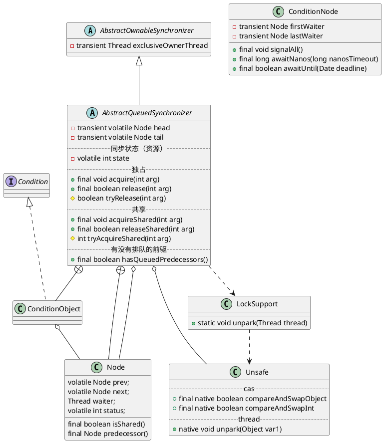

java.util.concurrent.locks.AbstractQueuedSynchronizer

## hierarchy
```
AbstractOwnableSynchronizer (java.util.concurrent.locks)
    AbstractQueuedSynchronizer (java.util.concurrent.locks)
        Worker in ThreadPoolExecutor (java.util.concurrent)
        Sync in CountDownLatch (java.util.concurrent)
        Sync in ReentrantLock (java.util.concurrent.locks)
            FairSync in ReentrantLock (java.util.concurrent.locks)
            NonfairSync in ReentrantLock (java.util.concurrent.locks)
        Sync in ReentrantReadWriteLock (java.util.concurrent.locks)
            FairSync in ReentrantReadWriteLock (java.util.concurrent.locks)
            NonfairSync in ReentrantReadWriteLock (java.util.concurrent.locks)
        Sync in Semaphore (java.util.concurrent)
            FairSync in Semaphore (java.util.concurrent)
            NonfairSync in Semaphore (java.util.concurrent)
        Sync in CountDownLatch2 (org.apache.rocketmq.common)
        Sync in LimitLatch (org.apache.tomcat.util.threads)
        LockableObject (org.codehaus.groovy.util)
            Segment in AbstractConcurrentMapBase (org.codehaus.groovy.util)
            LazyReference (org.codehaus.groovy.util)
```

## define
* volatile int 同步状态、信号量
* FIFO 同步队列、双向链表
* Condition 条件变量、等待队列（可多个）、通知、等待
* 继承、静态内部类；委派模式
* 模板方法模式
  * 独占式获取与释放同步状态
  * 共享式获取与释放同步状态
  * 查询同步队列中等待线程情况



## fields
```java
    private transient volatile Node head;
    private transient volatile Node tail;
    private volatile int state;
    static final long spinForTimeoutThreshold = 1000L; // 纳秒
```

## methods

### compareAndSetTail(Node expert, Node update)

### acquire
独占式 void acquire(int arg)
* !tryAcquire(arg) 线程安全的获取同步状态
* addWaiter(Node.EXCLUSIVE), arg) 将节点加到同步队列的尾部（compareAndSetTail + for循环）
* acquireQueued() 自旋，每个节点自省观察，前驱节点是头节点时，才能够获取同步状态`tryAcquire(arg)`；获取到同步状态就可以从这个自旋过程中退出。
  * selfInterrupt()

```java
    public final void acquire(int arg) {
        if (!tryAcquire(arg) &&
            acquireQueued(addWaiter(Node.EXCLUSIVE), arg))
            selfInterrupt();
    }
    
    protected boolean tryAcquire(int arg) {
        throw new UnsupportedOperationException();
    }
    
    private Node addWaiter(Node mode) {
        Node node = new Node(Thread.currentThread(), mode);
        // Try the fast path of enq; backup to full enq on failure
        Node pred = tail;
        if (pred != null) {
            node.prev = pred;
            if (compareAndSetTail(pred, node)) {
                pred.next = node;
                return node;
            }
        }
        enq(node);
        return node;
    }
    
    final boolean acquireQueued(final Node node, int arg) {
        boolean failed = true;
        try {
            boolean interrupted = false;
            for (;;) {
                final Node p = node.predecessor();
                if (p == head && tryAcquire(arg)) {
                    setHead(node);
                    p.next = null; // help GC
                    failed = false;
                    return interrupted;
                }
                if (shouldParkAfterFailedAcquire(p, node) &&
                    parkAndCheckInterrupt())
                    interrupted = true;
            }
        } finally {
            if (failed)
                cancelAcquire(node);
        }
    }
    
    static void selfInterrupt() {
        Thread.currentThread().interrupt();
    }
    
    private static boolean shouldParkAfterFailedAcquire(Node pred, Node node) {
        int ws = pred.waitStatus;
        if (ws == Node.SIGNAL)
            /*
             * This node has already set status asking a release
             * to signal it, so it can safely park.
             */
            return true;
        if (ws > 0) {
            /*
             * Predecessor was cancelled. Skip over predecessors and
             * indicate retry.
             */
            do {
                node.prev = pred = pred.prev;
            } while (pred.waitStatus > 0);
            pred.next = node;
        } else {
            /*
             * waitStatus must be 0 or PROPAGATE.  Indicate that we
             * need a signal, but don't park yet.  Caller will need to
             * retry to make sure it cannot acquire before parking.
             */
            compareAndSetWaitStatus(pred, ws, Node.SIGNAL);
        }
        return false;
    }
    
    private final boolean parkAndCheckInterrupt() {
        LockSupport.park(this);
        return Thread.interrupted();
    }
    
    
    
```


### release
独占式 boolean release(int arg)

```java
    public final boolean release(int arg) {
        if (tryRelease(arg)) {
            Node h = head;
            if (h != null && h.waitStatus != 0)
                unparkSuccessor(h);
            return true;
        }
        return false;
    }

    protected boolean tryRelease(int arg) {
        throw new UnsupportedOperationException();
    }
    
    private void unparkSuccessor(Node node) {
        /*
         * If status is negative (i.e., possibly needing signal) try
         * to clear in anticipation of signalling.  It is OK if this
         * fails or if status is changed by waiting thread.
         */
        int ws = node.waitStatus;
        if (ws < 0)
            compareAndSetWaitStatus(node, ws, 0);

        /*
         * Thread to unpark is held in successor, which is normally
         * just the next node.  But if cancelled or apparently null,
         * traverse backwards from tail to find the actual
         * non-cancelled successor.
         */
        Node s = node.next;
        if (s == null || s.waitStatus > 0) {
            s = null;
            for (Node t = tail; t != null && t != node; t = t.prev)
                if (t.waitStatus <= 0)
                    s = t;
        }
        if (s != null)
            LockSupport.unpark(s.thread);
    }
```  
  
  
### acquireShared
共享式 void acquireShared(int arg)
* tryAcquireShared(arg) < 0 尝试获取同步状态，返回值大于o，能够获取同步状态
  * doAcquireShared(arg) 
    * addWaiter(Node.SHARED) 
    * 自旋，当前节点的前趋节点为头节点时，尝试获取同步状态`tryAcquireShared(arg)`，如果返回值大于等于0，表示获取成功退出自旋。

```java
    public final void acquireShared(int arg) {
        if (tryAcquireShared(arg) < 0)
            doAcquireShared(arg);
    }
    
    protected int tryAcquireShared(int arg) {
        throw new UnsupportedOperationException();
    }    
    
    private void doAcquireShared(int arg) {
        final Node node = addWaiter(Node.SHARED);
        boolean failed = true;
        try {
            boolean interrupted = false;
            for (;;) {
                final Node p = node.predecessor();
                if (p == head) {
                    int r = tryAcquireShared(arg);
                    if (r >= 0) {
                        setHeadAndPropagate(node, r);
                        p.next = null; // help GC
                        if (interrupted)
                            selfInterrupt();
                        failed = false;
                        return;
                    }
                }
                if (shouldParkAfterFailedAcquire(p, node) &&
                    parkAndCheckInterrupt())
                    interrupted = true;
            }
        } finally {
            if (failed)
                cancelAcquire(node);
        }
    } 
```

### releaseShared
共享式 boolean releaseShared(int arg) 
```java
    public final boolean releaseShared(int arg) {
        if (tryReleaseShared(arg)) {
            doReleaseShared();
            return true;
        }
        return false;
    }
    
    protected boolean tryReleaseShared(int arg) {
        throw new UnsupportedOperationException();
    }
    
    private void doReleaseShared() {
        for (;;) {
            Node h = head;
            if (h != null && h != tail) {
                int ws = h.waitStatus;
                if (ws == Node.SIGNAL) {
                    if (!compareAndSetWaitStatus(h, Node.SIGNAL, 0))
                        continue;            // loop to recheck cases
                    unparkSuccessor(h);
                }
                else if (ws == 0 &&
                         !compareAndSetWaitStatus(h, 0, Node.PROPAGATE))
                    continue;                // loop on failed CAS
            }
            if (h == head)                   // loop if head changed
                break;
        }
    }    
```

### acquireInterruptibly
```java
    public final void acquireInterruptibly(int arg)
            throws InterruptedException {
        if (Thread.interrupted())
            throw new InterruptedException();
        if (!tryAcquire(arg))
            doAcquireInterruptibly(arg);
    }
    
    private void doAcquireInterruptibly(int arg)
        throws InterruptedException {
        final Node node = addWaiter(Node.EXCLUSIVE);
        boolean failed = true;
        try {
            for (;;) {
                final Node p = node.predecessor();
                if (p == head && tryAcquire(arg)) {
                    setHead(node);
                    p.next = null; // help GC
                    failed = false;
                    return;
                }
                if (shouldParkAfterFailedAcquire(p, node) &&
                    parkAndCheckInterrupt())
                    throw new InterruptedException();
            }
        } finally {
            if (failed)
                cancelAcquire(node);
        }
    }    
```

### acquireSharedInterruptibly
```java
    public final void acquireSharedInterruptibly(int arg)
            throws InterruptedException {
        if (Thread.interrupted())
            throw new InterruptedException();
        if (tryAcquireShared(arg) < 0)
            doAcquireSharedInterruptibly(arg);
    }
```
 
### tryAcquireSharedNanos
```java
    public final boolean tryAcquireSharedNanos(int arg, long nanosTimeout)
            throws InterruptedException {
        if (Thread.interrupted())
            throw new InterruptedException();
        return tryAcquireShared(arg) >= 0 ||
            doAcquireSharedNanos(arg, nanosTimeout);
    }
```

### transferForSignal
```java
    final boolean transferForSignal(Node node) {
        /*
         * If cannot change waitStatus, the node has been cancelled.
         */
        if (!compareAndSetWaitStatus(node, Node.CONDITION, 0))
            return false;

        /*
         * Splice onto queue and try to set waitStatus of predecessor to
         * indicate that thread is (probably) waiting. If cancelled or
         * attempt to set waitStatus fails, wake up to resync (in which
         * case the waitStatus can be transiently and harmlessly wrong).
         */
        Node p = enq(node);
        int ws = p.waitStatus;
        if (ws > 0 || !compareAndSetWaitStatus(p, ws, Node.SIGNAL))
            LockSupport.unpark(node.thread);
        return true;
    }
```

## inner class

### Node
```java
    static final class Node {
        volatile int waitStatus;
        volatile Node prev;
        volatile Node next;
        volatile Thread thread;
        Node nextWaiter;
    }
```

### ConditionObject
```java
    public class ConditionObject implements Condition, java.io.Serializable {
        private transient Node firstWaiter;
        private transient Node lastWaiter;
        
        private Node addConditionWaiter() {
            Node t = lastWaiter;
            // If lastWaiter is cancelled, clean out.
            if (t != null && t.waitStatus != Node.CONDITION) {
                unlinkCancelledWaiters();
                t = lastWaiter;
            }
            Node node = new Node(Thread.currentThread(), Node.CONDITION);
            if (t == null)
                firstWaiter = node;
            else
                t.nextWaiter = node;
            lastWaiter = node;
            return node;
        }
        
        private void doSignal(Node first) {
            do {
                if ( (firstWaiter = first.nextWaiter) == null)
                    lastWaiter = null;
                first.nextWaiter = null;
            } while (!transferForSignal(first) &&
                     (first = firstWaiter) != null);
        }
        
        private void doSignalAll(Node first) {
            lastWaiter = firstWaiter = null;
            do {
                Node next = first.nextWaiter;
                first.nextWaiter = null;
                transferForSignal(first);
                first = next;
            } while (first != null);
        }
        
        public final void signal() {
            if (!isHeldExclusively())
                throw new IllegalMonitorStateException();
            Node first = firstWaiter;
            if (first != null)
                doSignal(first);
        }
        
        public final void signalAll() {
            if (!isHeldExclusively())
                throw new IllegalMonitorStateException();
            Node first = firstWaiter;
            if (first != null)
                doSignalAll(first);
        }
        
        public final void await() throws InterruptedException {
            if (Thread.interrupted())
                throw new InterruptedException();
            Node node = addConditionWaiter();
            int savedState = fullyRelease(node);
            int interruptMode = 0;
            while (!isOnSyncQueue(node)) {
                LockSupport.park(this);
                if ((interruptMode = checkInterruptWhileWaiting(node)) != 0)
                    break;
            }
            if (acquireQueued(node, savedState) && interruptMode != THROW_IE)
                interruptMode = REINTERRUPT;
            if (node.nextWaiter != null) // clean up if cancelled
                unlinkCancelledWaiters();
            if (interruptMode != 0)
                reportInterruptAfterWait(interruptMode);
        }
        
        
    }    
```