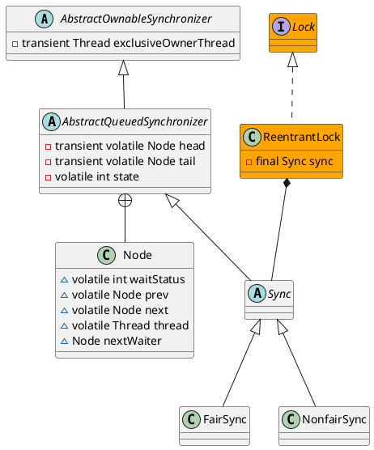

java.util.concurrent.locks.ReentrantLock
## hierarchy
```
ReentrantLock (java.util.concurrent.locks)
    Segment in ConcurrentHashMap (java.util.concurrent)
    Segment in ConcurrentReferenceHashMap (org.springframework.util)
    Segment in ConcurrentHashMap (org.jboss.netty.util.internal)
    Segment in ConcurrentIdentityHashMap (org.jboss.netty.util.internal)
    Segment in LocalCache (com.google.common.cache)
    ZkLock (org.I0Itec.zkclient)
```
## define
