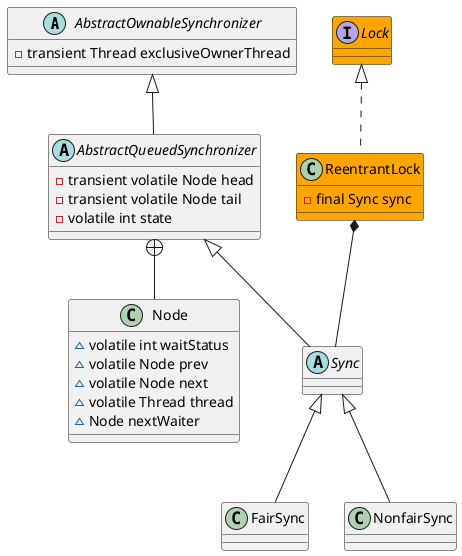

java.util.concurrent.locks.ReentrantLock
## hierarchy
```
ReentrantLock (java.util.concurrent.locks)
    Segment in ConcurrentHashMap (java.util.concurrent)
    Segment in ConcurrentReferenceHashMap (org.springframework.util)
    Segment in ConcurrentHashMap (org.jboss.netty.util.internal)
    Segment in ConcurrentIdentityHashMap (org.jboss.netty.util.internal)
    Segment in LocalCache (com.google.common.cache)
    ZkLock (org.I0Itec.zkclient)
```
## define


## InnerClass

### Sync
```java
abstract static class Sync extends AbstractQueuedSynchronizer {
    final boolean nonfairTryAcquire(int acquires) {
        final Thread current = Thread.currentThread();
        int c = getState();
        if (c == 0) {
            if (compareAndSetState(0, acquires)) {
                setExclusiveOwnerThread(current);
                return true;
            }
        }
        else if (current == getExclusiveOwnerThread()) {
            int nextc = c + acquires;
            if (nextc < 0) // overflow
                throw new Error("Maximum lock count exceeded");
            setState(nextc);
            return true;
        }
        return false;
    }

    protected final boolean tryRelease(int releases) {
        int c = getState() - releases;
        if (Thread.currentThread() != getExclusiveOwnerThread())
            throw new IllegalMonitorStateException();
        boolean free = false;
        if (c == 0) {
            free = true;
            setExclusiveOwnerThread(null);
        }
        setState(c);
        return free;
    }
}
```
### NonfairSync
```java
    static final class NonfairSync extends Sync {
        final void lock() {
            if (compareAndSetState(0, 1))
                setExclusiveOwnerThread(Thread.currentThread());
            else
                acquire(1);
        }
        protected final boolean tryAcquire(int acquires) {
            return nonfairTryAcquire(acquires);
        }
    }
```
### FairSync
```java
    static final class FairSync extends Sync {
        final void lock() {
            acquire(1);
        }
        protected final boolean tryAcquire(int acquires) {
            final Thread current = Thread.currentThread();
            int c = getState();
            if (c == 0) {
                if (!hasQueuedPredecessors() &&
                    compareAndSetState(0, acquires)) {
                    setExclusiveOwnerThread(current);
                    return true;
                }
            }
            else if (current == getExclusiveOwnerThread()) {
                int nextc = c + acquires;
                if (nextc < 0)
                    throw new Error("Maximum lock count exceeded");
                setState(nextc);
                return true;
            }
            return false;
        }
    }
```