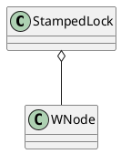

java.util.concurrent.locks.StampedLock


## define



## blog
读写锁虽然分离了读和写的功能,使得读与读之间可以完全并发,但是读和写之间依然是冲突的,读锁会完全阻塞写锁,它使用的依然是悲观的锁策略.
如果有大量的读线程,他也有可能引起写线程的饥饿

StampedLock则提供了一种乐观的读策略,这种乐观策略的锁非常类似于无锁的操作,使得乐观锁完全不会阻塞写线程

StampedLock的内部实现是基于CLH锁的,CLH锁是一种自旋锁,它保证没有饥饿的发生,并且可以保证FIFO(先进先出)的服务顺序


StampedLock的内部实现是基于CLH锁的,CLH锁是一种自旋锁,它保证没有饥饿的发生,并且可以保证FIFO(先进先出)的服务顺序.
CLH锁的基本思想如下:锁维护一个等待线程队列,所有申请锁,但是没有成功的线程都记录在这个队列中,每一个节点代表一个线程,保存一个标记位(locked).
用与判断当前线程是否已经释放锁;locked=true 没有获取到锁,false 已经成功释放了锁
当一个线程视图获得锁时,取得等待队列的尾部节点作为其前序节点.并使用类似如下代码判断前序节点是否已经成功释放锁:

```
while (pred.locked) {}
```

只要前序节点(pred)没有释放锁,则表示当前线程还不能继续执行,因此会自旋等待,
反之,如果前序线程已经释放锁,则当前线程可以继续执行.
释放锁时,也遵循这个逻辑,线程会将自身节点的locked位置标记位false,那么后续等待的线程就能继续执行了
     
     
## links
* [Java8 读写锁的改进:StampedLock(笔记)](https://www.cnblogs.com/ten951/p/6590579.html)