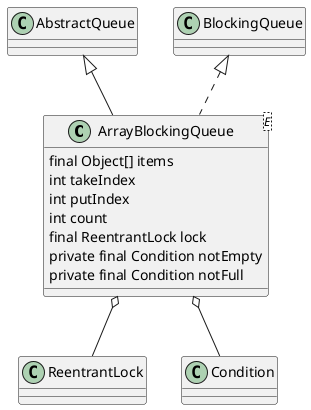

java.util.concurrent.ArrayBlockingQueue

## hierarchy
```
AbstractCollection (java.util)
    AbstractQueue (java.util)
        ArrayBlockingQueue (java.util.concurrent)
ArrayBlockingQueue (java.util.concurrent)
    AbstractQueue (java.util)
        AbstractCollection (java.util)
            Object (java.lang)
            Collection (java.util)
                Iterable (java.lang)
        Queue (java.util)
            Collection (java.util)
                Iterable (java.lang)
    BlockingQueue (java.util.concurrent)
        Queue (java.util)
            Collection (java.util)
                Iterable (java.lang)
```
## define
