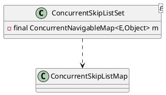

java.util.concurrent.ConcurrentSkipListSet

## hierarchy
```
AbstractCollection (java.util)
    AbstractSet (java.util)
        ConcurrentSkipListSet (java.util.concurrent)
ConcurrentSkipListSet (java.util.concurrent)
    AbstractSet (java.util)
        AbstractCollection (java.util)
        Set (java.util)
    NavigableSet (java.util)
        SortedSet (java.util)
    Cloneable (java.lang)
    Serializable (java.io)
```
## define


```java
public class ConcurrentSkipListSet<E>
    extends AbstractSet<E>
    implements NavigableSet<E>, Cloneable, java.io.Serializable {

    private static final long serialVersionUID = -2479143111061671589L;

    /**
     * The underlying map. Uses Boolean.TRUE as value for each
     * element.  This field is declared final for the sake of thread
     * safety, which entails some ugliness in clone().
     */
    private final ConcurrentNavigableMap<E,Object> m;
}    
```

## methods

### ConcurrentSkipListSet
```java
    public ConcurrentSkipListSet() {
        m = new ConcurrentSkipListMap<E,Object>();
    }

    public ConcurrentSkipListSet(Comparator<? super E> comparator) {
        m = new ConcurrentSkipListMap<E,Object>(comparator);
    }
```