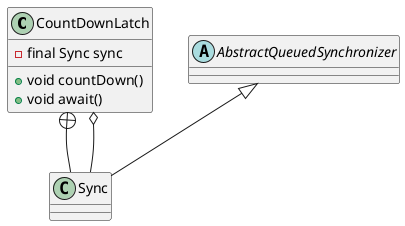

java.util.concurrent.CountDownLatch

一个或多个线程等待其他线程完成操作。join。


## define


## methods

### await
```java
    public void await() throws InterruptedException {
        sync.acquireSharedInterruptibly(1);
    }
    public boolean await(long timeout, TimeUnit unit)
        throws InterruptedException {
        return sync.tryAcquireSharedNanos(1, unit.toNanos(timeout));
    }
```
### coundDown 
```java
    public void countDown() {
        sync.releaseShared(1);
    }
```