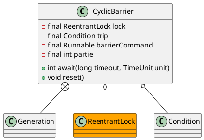

java.util.concurrent.CyclicBarrier

一组线程到达一个屏障时被阻塞，直到最后一个线程到达屏障时，屏障才会开门，所有被屏障拦截的线程才会继续进行。
- ReentrantLock
- Condition
  - trip.await()
  - trip.signalAll()

## define


## methods

### await
```java
    public int await() throws InterruptedException, BrokenBarrierException {
        try {
            return dowait(false, 0L);
        } catch (TimeoutException toe) {
            throw new Error(toe); // cannot happen
        }
    }
    public int await(long timeout, TimeUnit unit)
        throws InterruptedException,
               BrokenBarrierException,
               TimeoutException {
        return dowait(true, unit.toNanos(timeout));
    }
```

### dowait
```java
private int dowait(boolean timed, long nanos)
        throws InterruptedException, BrokenBarrierException,
               TimeoutException {
        final ReentrantLock lock = this.lock;
        lock.lock();
        try {
            final Generation g = generation;

            if (g.broken)
                throw new BrokenBarrierException();

            if (Thread.interrupted()) {
                breakBarrier();
                throw new InterruptedException();
            }

            int index = --count;
            if (index == 0) {  // tripped
                Runnable command = barrierCommand;
                if (command != null) {
                    try {
                        command.run();
                    } catch (Throwable ex) {
                        breakBarrier();
                        throw ex;
                    }
                }
                nextGeneration();
                return 0;
            }

            // loop until tripped, broken, interrupted, or timed out
            for (;;) {
                try {
                    if (!timed)
                        trip.await();
                    else if (nanos > 0L)
                        nanos = trip.awaitNanos(nanos);
                } catch (InterruptedException ie) {
                    if (g == generation && ! g.broken) {
                        breakBarrier();
                        throw ie;
                    } else {
                        // We're about to finish waiting even if we had not
                        // been interrupted, so this interrupt is deemed to
                        // "belong" to subsequent execution.
                        Thread.currentThread().interrupt();
                    }
                }

                if (g.broken)
                    throw new BrokenBarrierException();

                if (g != generation)
                    return index;

                if (timed && nanos <= 0L) {
                    breakBarrier();
                    throw new TimeoutException();
                }
            }
        } finally {
            lock.unlock();
        }
    }

```

### reset
```java
    public void reset() {
        final ReentrantLock lock = this.lock;
        lock.lock();
        try {
            breakBarrier();   // break the current generation
            nextGeneration(); // start a new generation
        } finally {
            lock.unlock();
        }
    }
```