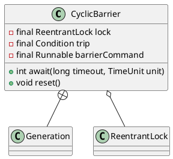

java.util.concurrent.CyclicBarrier

一组线程到达一个屏障时被阻塞，直到最后一个线程到达屏障时，屏障才会开门，所有被屏障拦截的线程才会继续进行。
- ReentrantLock
- Condition

## define

```plantuml
@startuml

class CyclicBarrier {
    - final ReentrantLock lock
    - final Condition trip
    - final Runnable barrierCommand
    + int await(long timeout, TimeUnit unit)
    + void reset()
}

CyclicBarrier +-- Generation
class Generation 

CyclicBarrier o-- ReentrantLock

@enduml
```
