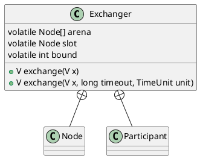

java.util.concurrent.Exchanger

用于线程间的数据交换，它提供一个同步点，在这个同步点，两个线程可以交换彼此的数据。

## define


## methods
### exchage
一个线程执行exchage()之后，一直等到另一个线程执行exchage()，当两个线程同时到达同步点时，这两个线程可以交换数据。
```java
// 交换数据
public V exchange(V x) throws InterruptedException {
    Object v;
    Object item = (x == null) ? NULL_ITEM : x; // translate null args
    if ((arena != null ||
         (v = slotExchange(item, false, 0L)) == null) &&
        ((Thread.interrupted() || // disambiguates null return
          (v = arenaExchange(item, false, 0L)) == null)))
        throw new InterruptedException();
    return (v == NULL_ITEM) ? null : (V)v;
}

// 可超时的交换
public V exchange(V x, long timeout, TimeUnit unit)
    throws InterruptedException, TimeoutException {
    Object v;
    Object item = (x == null) ? NULL_ITEM : x;
    long ns = unit.toNanos(timeout);
    if ((arena != null ||
         (v = slotExchange(item, true, ns)) == null) &&
        ((Thread.interrupted() ||
          (v = arenaExchange(item, true, ns)) == null)))
        throw new InterruptedException();
    if (v == TIMED_OUT)
        throw new TimeoutException();
    return (v == NULL_ITEM) ? null : (V)v;
}

```