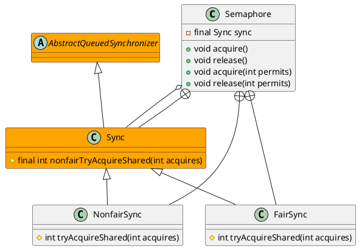

java.util.concurrent.Semaphore

控制同时访问特定资源的线程数量

## define


## methods

### acquire
```java
    public void acquire() throws InterruptedException {
        sync.acquireSharedInterruptibly(1);
    }
```

### acquire
```java
    public void acquire() throws InterruptedException {
        sync.acquireSharedInterruptibly(1);
    }
    public void acquire(int permits) throws InterruptedException {
        if (permits < 0) throw new IllegalArgumentException();
        sync.acquireSharedInterruptibly(permits);
    }
```

###
```java
    public void release() {
        sync.releaseShared(1);
    }
    public void release(int permits) {
        if (permits < 0) throw new IllegalArgumentException();
        sync.releaseShared(permits);
    }
```