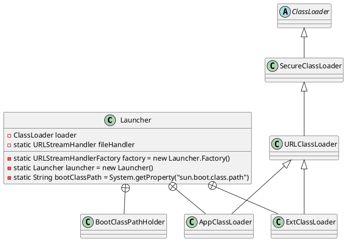

sun.misc.Launcher

* System.getProperty("sun.boot.class.path");
* System.getProperty("java.ext.dirs")
* System.getProperty("java.class.path")

## define



## inner class

### ExtClassLoader
* 单例模式 volatile + synchronized + 双重加锁检查

```java
class ExtClassLoader extends URLClassLoader {
    private static volatile Launcher.ExtClassLoader instance;

    public static Launcher.ExtClassLoader getExtClassLoader() throws IOException {
        if (instance == null) {
            Class var0 = Launcher.ExtClassLoader.class;
            synchronized(Launcher.ExtClassLoader.class) {
                if (instance == null) {
                    instance = createExtClassLoader();
                }
            }
        }

        return instance;
    }

    private static Launcher.ExtClassLoader createExtClassLoader() throws IOException {
        try {
            return (Launcher.ExtClassLoader)AccessController.doPrivileged(new PrivilegedExceptionAction<Launcher.ExtClassLoader>() {
                public Launcher.ExtClassLoader run() throws IOException {
                    File[] var1 = Launcher.ExtClassLoader.getExtDirs();
                    int var2 = var1.length;

                    for(int var3 = 0; var3 < var2; ++var3) {
                        MetaIndex.registerDirectory(var1[var3]);
                    }

                    return new Launcher.ExtClassLoader(var1);
                }
            });
        } catch (PrivilegedActionException var1) {
            throw (IOException)var1.getException();
        }
    }
}    
```

### AppClassLoader

```java
class AppClassLoader extends URLClassLoader {
    final URLClassPath ucp = SharedSecrets.getJavaNetAccess().getURLClassPath(this);

    public static ClassLoader getAppClassLoader(final ClassLoader var0) throws IOException {
        final String var1 = System.getProperty("java.class.path");
        final File[] var2 = var1 == null ? new File[0] : Launcher.getClassPath(var1);
        return (ClassLoader)AccessController.doPrivileged(new PrivilegedAction<Launcher.AppClassLoader>() {
            public Launcher.AppClassLoader run() {
                URL[] var1x = var1 == null ? new URL[0] : Launcher.pathToURLs(var2);
                return new Launcher.AppClassLoader(var1x, var0);
            }
        });
    }
    
    AppClassLoader(URL[] var1, ClassLoader var2) {
        super(var1, var2, Launcher.factory);
        this.ucp.initLookupCache(this);
    }
}
```