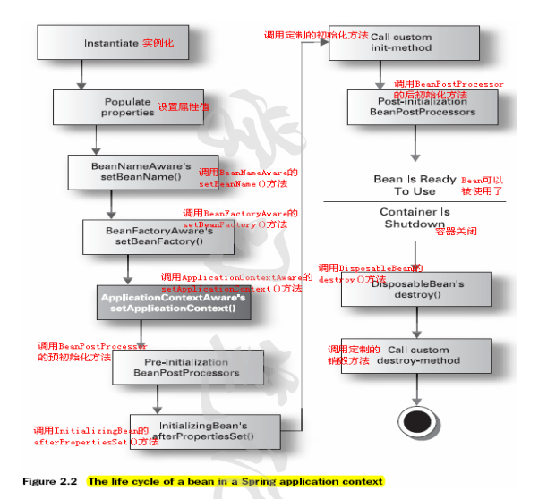

## 1. spring 启动
1. ApplicationContext	读取配置文件（资源文件定位、解析）
2. Configuration
3. instantiate init BeanFactory, BeanFactoryPostProcessor工厂后处理器
4. Registry 注册Bean后处理器；将BeanDefinition注册到BeanDefinitionRegistry中
5. MessageSource
6. ApplicationEventMulticaster
7. SingletoneBeanInit	单例初始化
8. Strategy	初始化策略
 

### ioc start
1. 初始化BeanFactory BeanDefinition -> BeanDefinitionRegistry
2. 调用工厂后处理器：根据反射机制从BeanDefinitionRegistry中找出所有BeanFactoryPostProcessor类型的Bean，并调用其postProcessBeanFactory()接口方法；
3. 注册Bean后处理器：根据反射机制从BeanDefinitionRegistry中找出所有BeanPostProcessor类型的Bean，并将它们注册到容器Bean后处理器的注册表中；
4. 初始化消息源：初始化容器的国际化信息资源；
5. 初始化应用上下文事件广播器；（观察者模式中的具体主题角色，持有观察者角色的集合，称为注册表）
6. 初始化其他特殊的Bean：这是一个钩子方法，子类可以借助这个钩子方法执行一些特殊的操作
7. 注册事件监听器；（观察者模式中的观察者角色）
8. 初始化singleton的Bean：实例化所有singleton的Bean，并将它们放入Spring容器的缓存中；这就是和直接在应用中使用BeanFactory的区别之处，
在创建ApplicationContext对象时，不仅创建了一个BeanFactory对象，并且还应用它实例化所有单实例的bean。（在spring的配置文件中，bean默认为单例，除非在bean的配置中显式指定scope="prototype"）
9. 发布上下文刷新事件：在此处时容器已经启动完成，发布容器refresh事件（ContextRefreshedEvent）

## 2. 装配
装配，或bean 装配是指在Spring 容器中把bean组装到一起，前提是容器需要知道bean的依赖关系，如何通过依赖注入来把它们装配到一起 
* no：默认的方式是不进行自动装配，通过显式设置ref 属性来进行装配。
* byName：通过参数名 自动装配，Spring容器在配置文件中发现bean的autowire属性被设置成byname，之后容器试图匹配、装配和该bean的属性具有相同名字的bean。
* byType:：通过参数类型自动装配，Spring容器在配置文件中发现bean的autowire属性被设置成byType，之后容器试图匹配、装配和该bean的属性具有相同类型的bean。如果有多个bean符合条件，则抛出错误。
* constructor：这个方式类似于byType， 但是要提供给构造器参数，如果没有确定的带参数的构造器参数类型，将会抛出异常。
* autodetect：首先尝试使用constructor来自动装配，如果无法工作，则使用byType方式。

## 3. Spring bean作用域
1.	single	每个spring容器一个实例，不是线程安全
2.	prototype 使用一次创建一次
3.	request	http请求（springmvc）
4.	session	http会话（springmvc）
5.	globalSession

 

## 4. Spring bean生命周期
对象的生命周期：创建（实例化-初始化）-使用-销毁

### 1.BeanFactoyPostProcessor实例化
### 2.Bean实例化
Bean实例化，然后通过某些BeanFactoyPostProcessor来进行依赖注入
Setter注入，执行Bean的属性依赖注入
### 3.BeanPostProcessor
调用Spring内置的BeanPostProcessor负责调用Bean实现的接口: BeanNameAware, BeanFactoryAware, ApplicationContextAware等等
调用完后才会调用自己配置的BeanPostProcessor
### 4.Bean初始化
如果配置有实现BeanPostProcessor的Bean，那么调用它的postProcessBeforeInitialization方法
如果Bean有实现InitializingBean接口那么对这些Bean进行调用
如果Bean配置有init属性，那么调用它属性中设置的方法
如果配置有实现BeanPostProcessor的Bean，那么调用它的postProcessAfterInitialization方法
### 5.Bean销毁阶段
调用DisposableBean接口的destory方法
调用Bean定义的destory方法
### spring-beans-life.png
 
### spring-beans-life-00.png
 
### spring-beans-life-01.png 
 


```java
public interface BeanFactoryPostProcessor {
	void postProcessBeanFactory(ConfigurableListableBeanFactory beanFactory) throws BeansException;
}
public interface BeanPostProcessor {
	Object postProcessBeforeInitialization(Object bean, String beanName) throws BeansException;
	Object postProcessAfterInitialization(Object bean, String beanName) throws BeansException;
}
```
