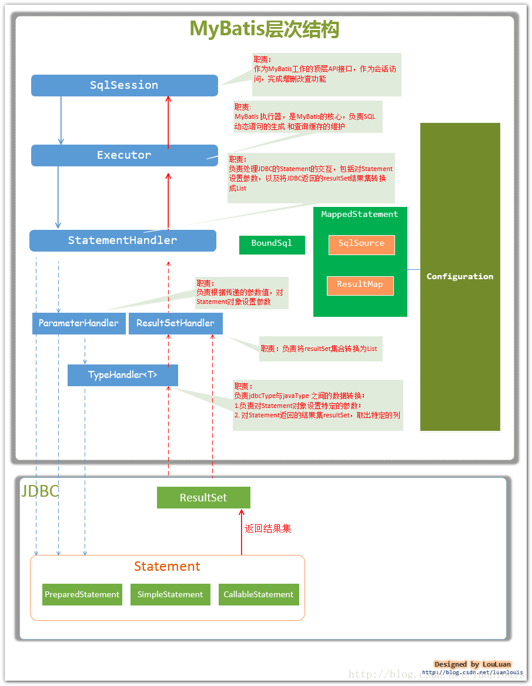
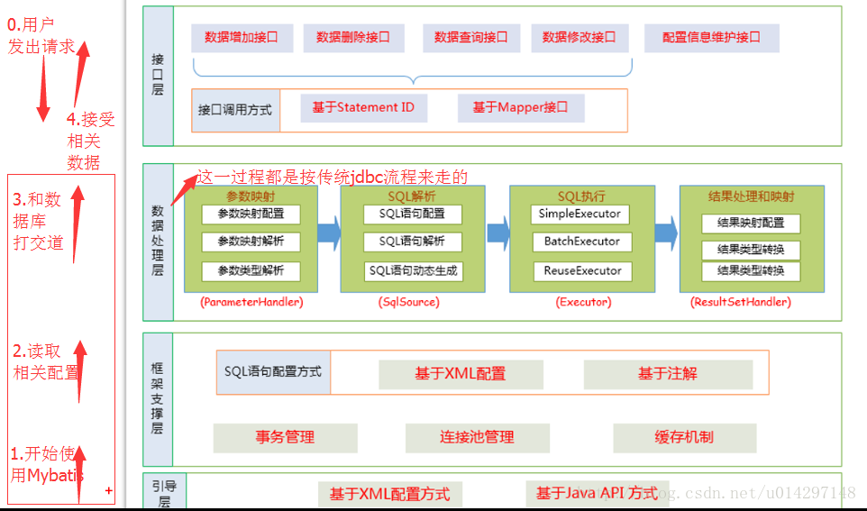

# Mybatis

## 主要组件
* Configuration       MyBatis所有的配置信息都保存在Configuration对象之中，配置文件中的大部分配置都会存储到该类中
* SqlSession          作为MyBatis工作的主要顶层API，表示和数据库交互时的会话，完成必要数据库增删改查功能
* Executor            MyBatis执行器，是MyBatis 调度的核心，负责SQL语句的生成和查询缓存的维护
* StatementHandler    封装了JDBC Statement操作，负责对JDBC statement 的操作，如设置参数等
* ParameterHandler    负责对用户传递的参数转换成JDBC Statement 所对应的数据类型
* ResultSetHandler    负责将JDBC返回的ResultSet结果集对象转换成List类型的集合
* TypeHandler         负责java数据类型和jdbc数据类型(也可以说是数据表列类型)之间的映射和转换
* MappedStatement     MappedStatement维护一条<select|update|delete|insert>节点的封装
* SqlSource           负责根据用户传递的parameterObject，动态地生成SQL语句，将信息封装到BoundSql对象中，并返回
* BoundSql            表示动态生成的SQL语句以及相应的参数信息

## Mybatis层次结构
* SqlSession
* Executor
* StatementHandler
* ParameterHandler ResultSetHandler
* TypeHandler

 

## Mybatis的框架分层
* interface
* core
* config

 

## links
- [MyBatis框架及原理分析](https://www.cnblogs.com/luoxn28/p/6417892.html) 
- [Mybatis之工作原理 ](https://blog.csdn.net/u014297148/article/details/78696096) 

## Mybatis 缓存
- 一级缓存是SqlSession级别的缓存。在操作数据库时需要构造sqlSession对象，在对象中有一个数据结构（HashMap）用于存储缓存数据。不同的sqlSession之间的缓存数据区域（HashMap）是互相不影响的。
- 二级缓存是mapper级别的缓存，多个SqlSession去操作同一个Mapper的sql语句，多个SqlSession可以**共用二级缓存**，二级缓存是跨SqlSession的。