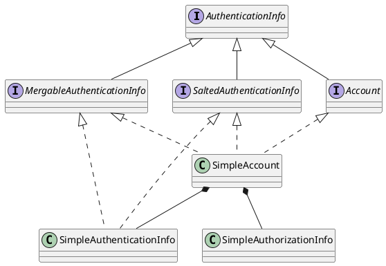

org.apache.shiro.authc.AuthenticationInfo

## Hierarchy
```
AuthenticationInfo (org.apache.shiro.authc)
    Account (org.apache.shiro.authc)
        SimpleAccount (org.apache.shiro.authc)
    MergableAuthenticationInfo (org.apache.shiro.authc)
        SimpleAccount (org.apache.shiro.authc)
        SimpleAuthenticationInfo (org.apache.shiro.authc)
    SaltedAuthenticationInfo (org.apache.shiro.authc)
        SimpleAccount (org.apache.shiro.authc)
        SimpleAuthenticationInfo (org.apache.shiro.authc)
```

## Define
