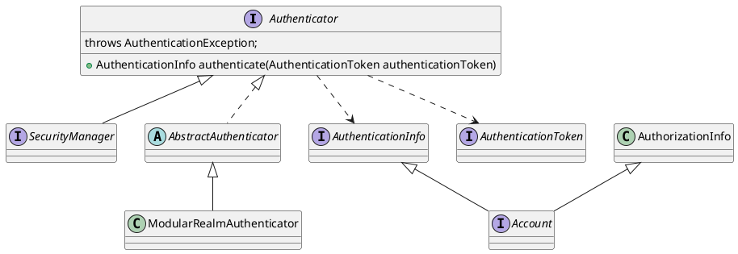

org.apache.shiro.authc.Authenticator

## Hierarchy
```
Authenticator (org.apache.shiro.authc)
    SecurityManager (org.apache.shiro.mgt)
    AbstractAuthenticator (org.apache.shiro.authc)
        ModularRealmAuthenticator (org.apache.shiro.authc.pam)
```

## Define
