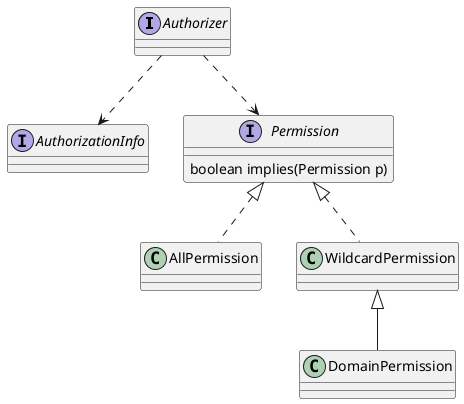

org.apache.shiro.authz

## Overview

```plantuml
@startuml

interface Authorizer

Authorizer ..> AuthorizationInfo
Authorizer ..> Permission

interface AuthorizationInfo

interface Permission {
    boolean implies(Permission p)
}

Permission ^.. AllPermission
Permission ^.. WildcardPermission
WildcardPermission ^-- DomainPermission

@enduml
```