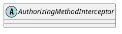

org.apache.shiro.authz.aop.AuthorizingMethodInterceptor

## hierarchy
```
MethodInterceptorSupport (org.apache.shiro.aop)
    AuthorizingMethodInterceptor (org.apache.shiro.authz.aop)
        AnnotationsAuthorizingMethodInterceptor (org.apache.shiro.authz.aop)
            AopAllianceAnnotationsAuthorizingMethodInterceptor (org.apache.shiro.spring.security.interceptor)
```

## define
