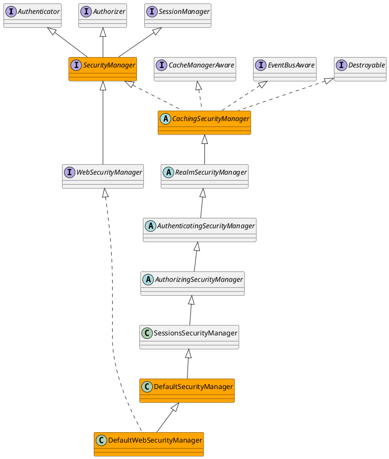

org.apache.shiro.mgt.CachingSecurityManager

## Hierarchy
```

```

## Define


```java
public abstract class CachingSecurityManager implements SecurityManager, Destroyable, CacheManagerAware, EventBusAware {
    private CacheManager cacheManager;
    private EventBus eventBus;
}
```