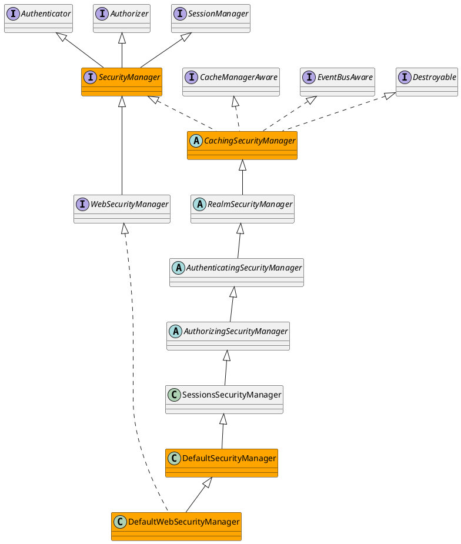

org.apache.shiro.mgt.DefaultSecurityManager

## Hierarchy
```

```

## Define


```java
public class DefaultSecurityManager extends SessionsSecurityManager {
    protected RememberMeManager rememberMeManager;
    protected SubjectDAO subjectDAO;
    protected SubjectFactory subjectFactory;
}
```

## Methods

### login
```java
    public Subject login(Subject subject, AuthenticationToken token) throws AuthenticationException {
        AuthenticationInfo info;
        try {
            info = authenticate(token);
        } catch (AuthenticationException ae) {
            try {
                onFailedLogin(token, ae, subject);
            } catch (Exception e) {
                if (log.isInfoEnabled()) {
                    log.info("onFailedLogin method threw an " +
                            "exception.  Logging and propagating original AuthenticationException.", e);
                }
            }
            throw ae; //propagate
        }

        Subject loggedIn = createSubject(token, info, subject);

        onSuccessfulLogin(token, info, loggedIn);

        return loggedIn;
    }
```

### createSubject
```java
    protected Subject createSubject(AuthenticationToken token, AuthenticationInfo info, Subject existing) {
        SubjectContext context = createSubjectContext();
        context.setAuthenticated(true);
        context.setAuthenticationToken(token);
        context.setAuthenticationInfo(info);
        if (existing != null) {
            context.setSubject(existing);
        }
        return createSubject(context);
    }
    
    protected SubjectContext createSubjectContext() {
        return new DefaultSubjectContext();
    }
```

### createSubject
```java
    public Subject createSubject(SubjectContext subjectContext) {
        //create a copy so we don't modify the argument's backing map:
        SubjectContext context = copy(subjectContext);

        //ensure that the context has a SecurityManager instance, and if not, add one:
        context = ensureSecurityManager(context);

        //Resolve an associated Session (usually based on a referenced session ID), and place it in the context before
        //sending to the SubjectFactory.  The SubjectFactory should not need to know how to acquire sessions as the
        //process is often environment specific - better to shield the SF from these details:
        context = resolveSession(context);

        //Similarly, the SubjectFactory should not require any concept of RememberMe - translate that here first
        //if possible before handing off to the SubjectFactory:
        context = resolvePrincipals(context);

        Subject subject = doCreateSubject(context);

        //save this subject for future reference if necessary:
        //(this is needed here in case rememberMe principals were resolved and they need to be stored in the
        //session, so we don't constantly rehydrate the rememberMe PrincipalCollection on every operation).
        //Added in 1.2:
        save(subject);

        return subject;
    }
```