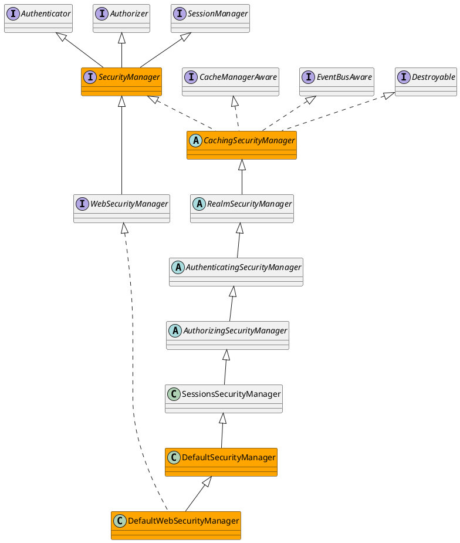

org.apache.shiro.mgt.SecurityManager

## Define



```java

public interface SecurityManager extends Authenticator, Authorizer, SessionManager {

    Subject login(Subject subject, AuthenticationToken authenticationToken) throws AuthenticationException;

    void logout(Subject subject);

    Subject createSubject(SubjectContext context);

}

```