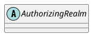

org.apache.shiro.realm.AuthorizingRealm

## Hierarchy
```

```

## Define



## Stack

```
doGetAuthenticationInfo:50, AdminAuthorizingRealm {org.linlinjava.litemall.admin.shiro}
getAuthenticationInfo:571, AuthenticatingRealm {org.apache.shiro.realm}
doSingleRealmAuthentication:180, ModularRealmAuthenticator {org.apache.shiro.authc.pam}
doAuthenticate:267, ModularRealmAuthenticator {org.apache.shiro.authc.pam}
authenticate:198, AbstractAuthenticator {org.apache.shiro.authc}
authenticate:106, AuthenticatingSecurityManager {org.apache.shiro.mgt}
login:274, DefaultSecurityManager {org.apache.shiro.mgt}
login:260, DelegatingSubject {org.apache.shiro.subject.support}
login:63, AdminAuthController {org.linlinjava.litemall.admin.web}
```