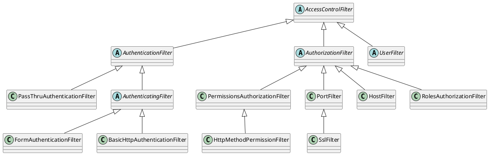

org.apache.shiro.web.filter.AccessControlFilter

## Hierarchy
```
ServletContextSupport (org.apache.shiro.web.servlet)
    AbstractFilter (org.apache.shiro.web.servlet)
        NameableFilter (org.apache.shiro.web.servlet)
            OncePerRequestFilter (org.apache.shiro.web.servlet)
                AdviceFilter (org.apache.shiro.web.servlet)
                    PathMatchingFilter (org.apache.shiro.web.filter)
                        AccessControlFilter (org.apache.shiro.web.filter)
                            AuthenticationFilter (org.apache.shiro.web.filter.authc)
                                PassThruAuthenticationFilter (org.apache.shiro.web.filter.authc)
                                AuthenticatingFilter (org.apache.shiro.web.filter.authc)
                                    FormAuthenticationFilter (org.apache.shiro.web.filter.authc)
                                    BasicHttpAuthenticationFilter (org.apache.shiro.web.filter.authc)
                            AuthorizationFilter (org.apache.shiro.web.filter.authz)
                                PermissionsAuthorizationFilter (org.apache.shiro.web.filter.authz)
                                    HttpMethodPermissionFilter (org.apache.shiro.web.filter.authz)
                                PortFilter (org.apache.shiro.web.filter.authz)
                                    SslFilter (org.apache.shiro.web.filter.authz)
                                HostFilter (org.apache.shiro.web.filter.authz)
                                RolesAuthorizationFilter (org.apache.shiro.web.filter.authz)
                            UserFilter (org.apache.shiro.web.filter.authc)
```
## Define


```java
public abstract class AccessControlFilter extends PathMatchingFilter {
    public static final String DEFAULT_LOGIN_URL = "/login.jsp";
    public static final String GET_METHOD = "GET";
    public static final String POST_METHOD = "POST";
    private String loginUrl = DEFAULT_LOGIN_URL;
    public String getLoginUrl() {
        return loginUrl;
    }
    public void setLoginUrl(String loginUrl) {
        this.loginUrl = loginUrl;
    }
    protected Subject getSubject(ServletRequest request, ServletResponse response) {
        return SecurityUtils.getSubject();
    }
    protected abstract boolean isAccessAllowed(ServletRequest request, ServletResponse response, Object mappedValue) throws Exception;
    protected boolean onAccessDenied(ServletRequest request, ServletResponse response, Object mappedValue) throws Exception {
        return onAccessDenied(request, response);
    }

    protected abstract boolean onAccessDenied(ServletRequest request, ServletResponse response) throws Exception;
    public boolean onPreHandle(ServletRequest request, ServletResponse response, Object mappedValue) throws Exception {
        return isAccessAllowed(request, response, mappedValue) || onAccessDenied(request, response, mappedValue);
    }
    protected boolean isLoginRequest(ServletRequest request, ServletResponse response) {
        return pathsMatch(getLoginUrl(), request);
    }
    protected void saveRequestAndRedirectToLogin(ServletRequest request, ServletResponse response) throws IOException {
        saveRequest(request);
        redirectToLogin(request, response);
    }
    protected void saveRequest(ServletRequest request) {
        WebUtils.saveRequest(request);
    }
    protected void redirectToLogin(ServletRequest request, ServletResponse response) throws IOException {
        String loginUrl = getLoginUrl();
        WebUtils.issueRedirect(request, response, loginUrl);
    }
}

```