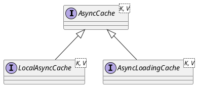

com.github.benmanes.caffeine.cache.AsyncCache
- CompletableFuture

## Hierarchy
```
AsyncCache (com.github.benmanes.caffeine.cache)
    LocalAsyncCache (com.github.benmanes.caffeine.cache)
        UnboundedLocalAsyncCache in UnboundedLocalCache (com.github.benmanes.caffeine.cache)
        LocalAsyncLoadingCache (com.github.benmanes.caffeine.cache)
        BoundedLocalAsyncCache in BoundedLocalCache (com.github.benmanes.caffeine.cache)
    AsyncLoadingCache (com.github.benmanes.caffeine.cache)
        AutoRoutingLocalAsyncLoadingCache in CaffeineCacheInterceptor (cn.com.duibaboot.ext.autoconfigure.perftest.caffeine)
        LocalAsyncLoadingCache (com.github.benmanes.caffeine.cache)
```

## Define


```java
public interface AsyncCache<K, V> {
    CompletableFuture<V> getIfPresent(@NonNull Object key);
    CompletableFuture<V> get(@NonNull K key,
          @NonNull Function<? super K, ? extends V> mappingFunction);
    CompletableFuture<V> get(@NonNull K key,
           @NonNull BiFunction<? super K, Executor, CompletableFuture<V>> mappingFunction);
    void put(@NonNull K key, @NonNull CompletableFuture<V> valueFuture);
    ConcurrentMap<@NonNull K, @NonNull CompletableFuture<V>> asMap();
    Cache<K, V> synchronous();
}
```