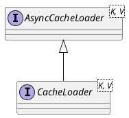

com.github.benmanes.caffeine.cache.AsyncCacheLoader

## Hierarchy
```
AsyncCacheLoader (com.github.benmanes.caffeine.cache)
    CacheLoader (com.github.benmanes.caffeine.cache)
        1 in BoundedLocalAsyncLoadingCache in BoundedLocalCache (com.github.benmanes.caffeine.cache)
        AsyncLoader in BoundedLocalAsyncLoadingCache in BoundedLocalCache (com.github.benmanes.caffeine.cache)
```

## Define


```java
@FunctionalInterface
public interface AsyncCacheLoader<K, V> {

  @NonNull
  CompletableFuture<V> asyncLoad(@NonNull K key, @NonNull Executor executor);

  @NonNull
  default CompletableFuture<Map<@NonNull K, @NonNull V>> asyncLoadAll(
      @NonNull Iterable<? extends @NonNull K> keys, @NonNull Executor executor) {
    throw new UnsupportedOperationException();
  }

  @NonNull
  default CompletableFuture<V> asyncReload(
      @NonNull K key, @NonNull V oldValue, @NonNull Executor executor) {
    return asyncLoad(key, executor);
  }
}
```