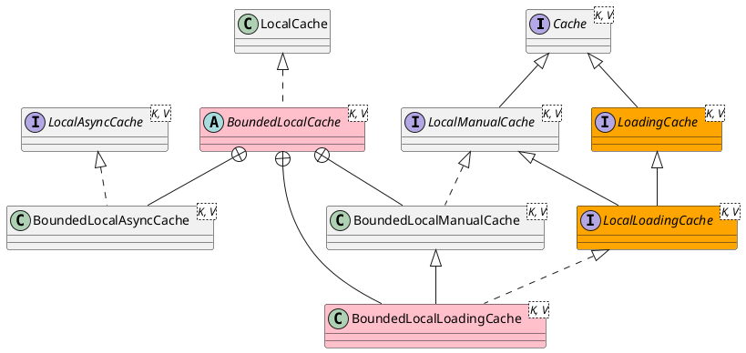

com.github.benmanes.caffeine.cache.BoundedLocalCache

## Hierarchy
```
AbstractMap (java.util)
    PadDrainStatus in BLCHeader (com.github.benmanes.caffeine.cache)
        DrainStatusRef in BLCHeader (com.github.benmanes.caffeine.cache)
            BoundedLocalCache (com.github.benmanes.caffeine.cache)
                WS (com.github.benmanes.caffeine.cache)
                SI in LocalCacheFactory (com.github.benmanes.caffeine.cache)
                SS (com.github.benmanes.caffeine.cache)
                WI in LocalCacheFactory (com.github.benmanes.caffeine.cache)
                SS in LocalCacheFactory (com.github.benmanes.caffeine.cache)
                WI (com.github.benmanes.caffeine.cache)
                WS in LocalCacheFactory (com.github.benmanes.caffeine.cache)
                SI (com.github.benmanes.caffeine.cache)
```

## Define


```java
@ThreadSafe
abstract class BoundedLocalCache<K, V> extends BLCHeader.DrainStatusRef<K, V>
    implements LocalCache<K, V> {
    
}
```

## Methods

### computeIfAbsent
```java
  public @Nullable V computeIfAbsent(K key, Function<? super K, ? extends V> mappingFunction,
      boolean recordStats, boolean recordLoad) {
    requireNonNull(key);
    requireNonNull(mappingFunction);
    long now = expirationTicker().read();

    // An optimistic fast path to avoid unnecessary locking
    Node<K, V> node = data.get(nodeFactory.newLookupKey(key));
    if (node != null) {
      V value = node.getValue();
      if ((value != null) && !hasExpired(node, now)) {
        if (!isComputingAsync(node)) {
          tryExpireAfterRead(node, key, value, expiry(), now);
          setAccessTime(node, now);
        }

        afterRead(node, now, /* recordHit */ recordStats);
        return value;
      }
    }
    if (recordStats) {
      mappingFunction = statsAware(mappingFunction, recordLoad);
    }
    Object keyRef = nodeFactory.newReferenceKey(key, keyReferenceQueue());
    return doComputeIfAbsent(key, keyRef, mappingFunction, new long[] { now }, recordStats);
  }
```

## Inner Class

### BoundedLocalLoadingCache
```java
    static final class BoundedLocalLoadingCache<K, V>
      extends BoundedLocalManualCache<K, V> implements LocalLoadingCache<K, V> {
    
        BoundedLocalLoadingCache(Caffeine<K, V> builder, CacheLoader<? super K, V> loader) {
          super(builder, loader);
          requireNonNull(loader);
          hasBulkLoader = hasLoadAll(loader);
          mappingFunction = key -> {
            try {
              return loader.load(key);
            } catch (RuntimeException e) {
              throw e;
            } catch (InterruptedException e) {
              Thread.currentThread().interrupt();
              throw new CompletionException(e);
            } catch (Exception e) {
              throw new CompletionException(e);
            }
          };
        }
    }
```