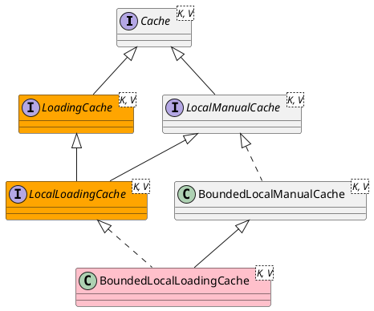

com.github.benmanes.caffeine.cache.LocalLoadingCache

## Hierarchy
```
LocalLoadingCache (com.github.benmanes.caffeine.cache)
    LocalManualCache (com.github.benmanes.caffeine.cache)
        Cache (com.github.benmanes.caffeine.cache)
    LoadingCache (com.github.benmanes.caffeine.cache)
        Cache (com.github.benmanes.caffeine.cache)
```

## Define


```java
interface LocalLoadingCache<K, V> extends LocalManualCache<K, V>, LoadingCache<K, V> {
    
}
```