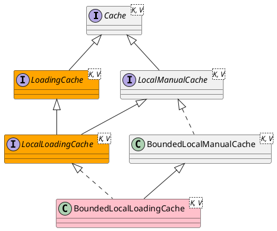

com.github.benmanes.caffeine.cache.LocalLoadingCache

## Hierarchy
```
LocalLoadingCache (com.github.benmanes.caffeine.cache)
    LocalManualCache (com.github.benmanes.caffeine.cache)
        Cache (com.github.benmanes.caffeine.cache)
    LoadingCache (com.github.benmanes.caffeine.cache)
        Cache (com.github.benmanes.caffeine.cache)
```

## Define


```java
interface LocalLoadingCache<K, V> extends LocalManualCache<K, V>, LoadingCache<K, V> {

      final ConcurrentHashMap<Object, Node<K, V>> data; // 数据底层存储
      @Nullable final CacheLoader<K, V> cacheLoader;
      final PerformCleanupTask drainBuffersTask;
      final Consumer<Node<K, V>> accessPolicy;
      final Buffer<Node<K, V>> readBuffer;
      final NodeFactory<K, V> nodeFactory;
      final ReentrantLock evictionLock;
      final CacheWriter<K, V> writer;
      final Weigher<K, V> weigher;
      final Executor executor;
      final boolean isAsync;
    
      // The collection views
      @Nullable transient Set<K> keySet;
      @Nullable transient Collection<V> values;
      @Nullable transient Set<Entry<K, V>> entrySet;
}
```

## Methods

### get
```java
  default @Nullable V get(K key) {
    return cache().computeIfAbsent(key, mappingFunction());
  }
```