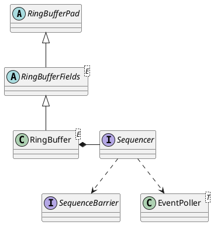

com.lmax.disruptor.RingBuffer

- 环行数组

## hierarchy
```
RingBufferPad (com.lmax.disruptor)
    RingBufferFields (com.lmax.disruptor)
        RingBuffer (com.lmax.disruptor)
        
RingBuffer (com.lmax.disruptor)
    RingBufferFields (com.lmax.disruptor)
        RingBufferPad (com.lmax.disruptor)
    Cursored (com.lmax.disruptor)
    EventSequencer (com.lmax.disruptor)
        DataProvider (com.lmax.disruptor)
        Sequenced (com.lmax.disruptor)
    EventSink (com.lmax.disruptor)
```

## define
