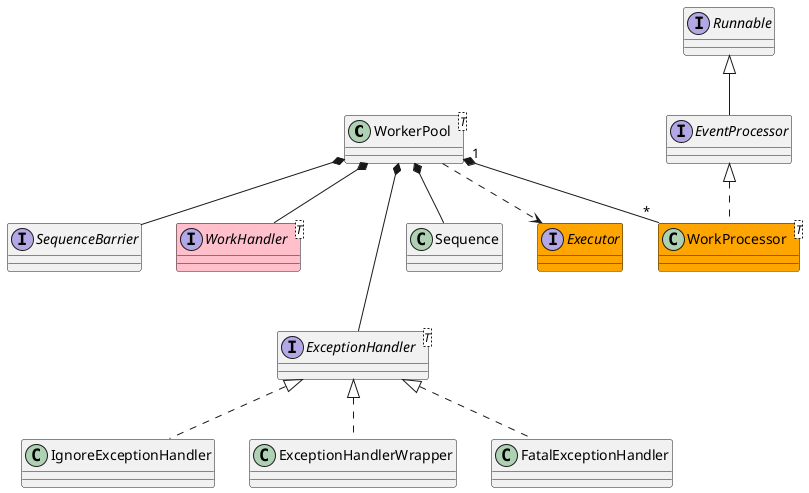

com.lmax.disruptor.WorkerPool

## define


## methods

### start
```java
    public RingBuffer<T> start(final Executor executor) {
        if (!started.compareAndSet(false, true)) {
            throw new IllegalStateException("WorkerPool has already been started and cannot be restarted until halted.");
        }

        final long cursor = ringBuffer.getCursor();
        workSequence.set(cursor);

        for (WorkProcessor<?> processor : workProcessors) {
            processor.getSequence().set(cursor);
            executor.execute(processor);
        }

        return ringBuffer;
    }
```