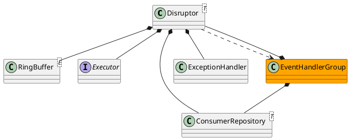

com.lmax.disruptor.dsl.Disruptor

## define


## methods

### handleEventsWith
```java
    @SafeVarargs
    public final EventHandlerGroup<T> handleEventsWith(final EventHandler<? super T>... handlers) {
        return createEventProcessors(new Sequence[0], handlers);
    }
    
    // 并行执行
    // disruptor.handleEventsWith(handler1, handler2)
    
    // 串行/顺序执行
    // disruptor.handleEventsWith(handler1).handleEventsWith(handler2)
    
```

## Demo
```java
// 六边形执行
//          h1 -> h4 
// p  ->                -> h3
//          h2 -> h5 
disruptor.handleEventsWith(h1, h2);
disruptor.after(h1).handleEventsWith(h4);
disruptor.after(h2).handleEventsWith(h5);
disruptor.after(h4, h5).handleEventsWith(h3);
```