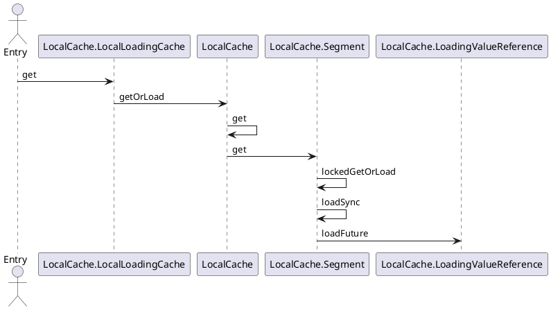

guava

## Overview
- cache
    - [Cache](/docs/20-framework/src/common/google/guava/cache/Cache.md)
    - [LoadingCache](/docs/20-framework/src/common/google/guava/cache/LoadingCache.md)
    - [LocalCache](/docs/20-framework/src/common/google/guava/cache/LocalCache.md)

## package
```
com.google
    common
        annotations
        base
        cache
            Cache
            CacheBuilder
            CacheLoader
        collect
            BiMap
        escape
        eventbus
        graph
        hash
            BloomFilter
            BloomFilterStrategies
            LongAdder
        html
        io
        math
        net
        primitives
        reflect
        util.concurrent
            SimpleTimeLimiter
            SmoothRateLimiter
            TimeLimiter
        xml
    thirdparty.publicsuffix
```


## stack
```
load:46, CacheController$1 (com.onion.spring.demo.web.controller.demo)
load:44, CacheController$1 (com.onion.spring.demo.web.controller.demo)
loadFuture:3628, LocalCache$LoadingValueReference (com.google.common.cache)
loadSync:2336, LocalCache$Segment (com.google.common.cache)
lockedGetOrLoad:2295, LocalCache$Segment (com.google.common.cache)
get:2208, LocalCache$Segment (com.google.common.cache)
get:4053, LocalCache (com.google.common.cache)
getOrLoad:4057, LocalCache (com.google.common.cache)
get:4986, LocalCache$LocalLoadingCache (com.google.common.cache)
guavaCache:62, CacheController (com.onion.spring.demo.web.controller.demo)
```

