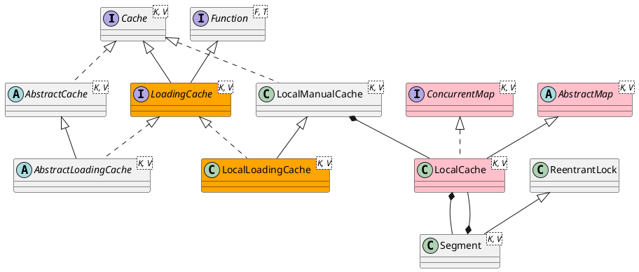

com.google.common.cache.Cache

## Hierarchy
```
Cache (com.google.common.cache)
    ForwardingCache (com.google.common.cache)
    LoadingCache (com.google.common.cache)
        LocalLoadingCache in LocalCache (com.google.common.cache)
        LoadingSerializationProxy in LocalCache (com.google.common.cache)
        ForwardingLoadingCache (com.google.common.cache)
        AbstractLoadingCache (com.google.common.cache)
    LocalManualCache in LocalCache (com.google.common.cache)
        LocalLoadingCache in LocalCache (com.google.common.cache)
    AbstractCache (com.google.common.cache)
        AbstractLoadingCache (com.google.common.cache)
```

## Define
