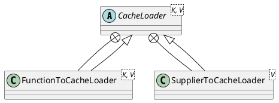

com.google.common.cache.CacheLoader

## Hierarchy
```
CacheLoader (com.google.common.cache)
    FunctionToCacheLoader in CacheLoader (com.google.common.cache)
    SupplierToCacheLoader in CacheLoader (com.google.common.cache)

```


## Define



```java
@GwtCompatible(emulated = true)
public abstract class CacheLoader<K, V> {
    
  protected CacheLoader() {}
  
  public abstract V load(K key) throws Exception;
  
  @GwtIncompatible("Futures")
  public ListenableFuture<V> reload(K key, V oldValue) throws Exception {
    checkNotNull(key);
    checkNotNull(oldValue);
    return Futures.immediateFuture(load(key));
  }
  
  public Map<K, V> loadAll(Iterable<? extends K> keys) throws Exception {
    // This will be caught by getAll(), causing it to fall back to multiple calls to
    // LoadingCache.get
    throw new UnsupportedLoadingOperationException();
  }
  
}
```