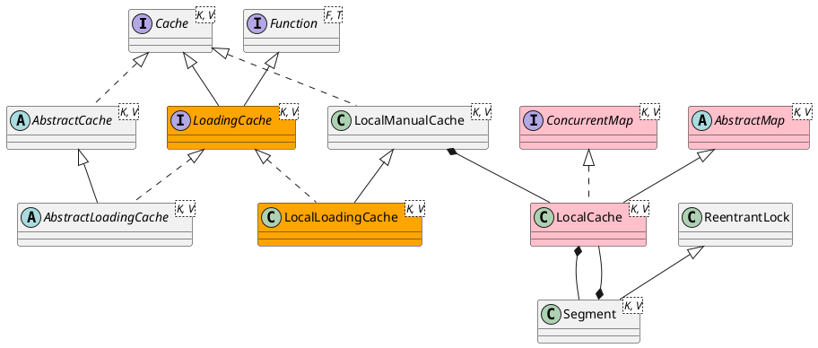

com.google.common.cache.LoadingCache

## hierarchy
```
LoadingCache (com.google.common.cache)
    LocalLoadingCache in LocalCache (com.google.common.cache)
    LoadingSerializationProxy in LocalCache (com.google.common.cache)
    ForwardingLoadingCache (com.google.common.cache)
        SimpleForwardingLoadingCache in ForwardingLoadingCache (com.google.common.cache)
    AbstractLoadingCache (com.google.common.cache)
```

## define


```java
public interface LoadingCache<K, V> extends Cache<K, V>, Function<K, V> {
    V get(K key) throws ExecutionException;
    V getUnchecked(K key);
    ImmutableMap<K, V> getAll(Iterable<? extends K> keys) throws ExecutionException;
    V apply(K key);
    void refresh(K key);
    ConcurrentMap<K, V> asMap();
}
```