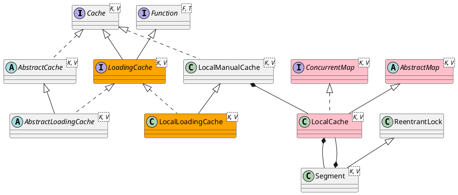

com.google.common.cache.LocalCache

## Define


```java
class LocalCache<K, V> extends AbstractMap<K, V> implements ConcurrentMap<K, V> {
    final int concurrencyLevel;
    final Segment<K, V>[] segments;
    final RemovalListener<K, V> removalListener;
    final StatsCounter globalStatsCounter;
    final CacheLoader<? super K, V> defaultLoader;
}
```

## Methods

### constructor
```java
  LocalCache(
      CacheBuilder<? super K, ? super V> builder, @Nullable CacheLoader<? super K, V> loader) {
    concurrencyLevel = Math.min(builder.getConcurrencyLevel(), MAX_SEGMENTS);

    keyStrength = builder.getKeyStrength();
    valueStrength = builder.getValueStrength();

    keyEquivalence = builder.getKeyEquivalence();
    valueEquivalence = builder.getValueEquivalence();

    maxWeight = builder.getMaximumWeight();
    weigher = builder.getWeigher();
    expireAfterAccessNanos = builder.getExpireAfterAccessNanos();
    expireAfterWriteNanos = builder.getExpireAfterWriteNanos();
    refreshNanos = builder.getRefreshNanos();

    removalListener = builder.getRemovalListener();
    removalNotificationQueue =
        (removalListener == NullListener.INSTANCE)
            ? LocalCache.<RemovalNotification<K, V>>discardingQueue()
            : new ConcurrentLinkedQueue<RemovalNotification<K, V>>();

    ticker = builder.getTicker(recordsTime());
    entryFactory = EntryFactory.getFactory(keyStrength, usesAccessEntries(), usesWriteEntries());
    globalStatsCounter = builder.getStatsCounterSupplier().get();
    defaultLoader = loader;

    int initialCapacity = Math.min(builder.getInitialCapacity(), MAXIMUM_CAPACITY);
    if (evictsBySize() && !customWeigher()) {
      initialCapacity = (int) Math.min(initialCapacity, maxWeight);
    }

    // Find the lowest power-of-two segmentCount that exceeds concurrencyLevel, unless
    // maximumSize/Weight is specified in which case ensure that each segment gets at least 10
    // entries. The special casing for size-based eviction is only necessary because that eviction
    // happens per segment instead of globally, so too many segments compared to the maximum size
    // will result in random eviction behavior.
    int segmentShift = 0;
    int segmentCount = 1;
    while (segmentCount < concurrencyLevel && (!evictsBySize() || segmentCount * 20 <= maxWeight)) {
      ++segmentShift;
      segmentCount <<= 1;
    }
    this.segmentShift = 32 - segmentShift;
    segmentMask = segmentCount - 1;

    this.segments = newSegmentArray(segmentCount);

    int segmentCapacity = initialCapacity / segmentCount;
    if (segmentCapacity * segmentCount < initialCapacity) {
      ++segmentCapacity;
    }

    int segmentSize = 1;
    while (segmentSize < segmentCapacity) {
      segmentSize <<= 1;
    }

    if (evictsBySize()) {
      // Ensure sum of segment max weights = overall max weights
      long maxSegmentWeight = maxWeight / segmentCount + 1;
      long remainder = maxWeight % segmentCount;
      for (int i = 0; i < this.segments.length; ++i) {
        if (i == remainder) {
          maxSegmentWeight--;
        }
        this.segments[i] =
            createSegment(segmentSize, maxSegmentWeight, builder.getStatsCounterSupplier().get());
      }
    } else {
      for (int i = 0; i < this.segments.length; ++i) {
        this.segments[i] =
            createSegment(segmentSize, UNSET_INT, builder.getStatsCounterSupplier().get());
      }
    }
  }
```

### get
```java
  public V get(@Nullable Object key) {
    if (key == null) {
      return null;
    }
    int hash = hash(key);
    return segmentFor(hash).get(key, hash);
  }
```

### put
```java
  public V put(K key, V value) {
    checkNotNull(key);
    checkNotNull(value);
    int hash = hash(key);
    return segmentFor(hash).put(key, hash, value, false);
  }
```

### newEntry
```java
  ReferenceEntry<K, V> newEntry(K key, int hash, @Nullable ReferenceEntry<K, V> next) {
    Segment<K, V> segment = segmentFor(hash);
    segment.lock();
    try {
      return segment.newEntry(key, hash, next);
    } finally {
      segment.unlock();
    }
  }
```

### segmentFor
```java
  Segment<K, V> segmentFor(int hash) {
    // TODO(fry): Lazily create segments?
    return segments[(hash >>> segmentShift) & segmentMask];
  }
```

## Inner Class

### Segment
```java
static class Segment<K, V> extends ReentrantLock {
    final LocalCache<K, V> map;
    long totalWeight;
    volatile AtomicReferenceArray<ReferenceEntry<K, V>> table;
    final ReferenceQueue<K> keyReferenceQueue;
    final ReferenceQueue<V> valueReferenceQueue;
    final Queue<ReferenceEntry<K, V>> recencyQueue;
    final AtomicInteger readCount = new AtomicInteger();
    final Queue<ReferenceEntry<K, V>> writeQueue;
    final Queue<ReferenceEntry<K, V>> accessQueue;
    final StatsCounter statsCounter;
}
```

#### Segment Methods

#####  Segment.get
```java
    V get(K key, int hash, CacheLoader<? super K, V> loader) throws ExecutionException {
      checkNotNull(key);
      checkNotNull(loader);
      try {
        if (count != 0) { // read-volatile
          // don't call getLiveEntry, which would ignore loading values
          ReferenceEntry<K, V> e = getEntry(key, hash);
          if (e != null) {
            long now = map.ticker.read();
            V value = getLiveValue(e, now);
            if (value != null) {
              recordRead(e, now);
              statsCounter.recordHits(1);
              return scheduleRefresh(e, key, hash, value, now, loader);
            }
            ValueReference<K, V> valueReference = e.getValueReference();
            if (valueReference.isLoading()) {
              return waitForLoadingValue(e, key, valueReference);
            }
          }
        }

        // at this point e is either null or expired;
        return lockedGetOrLoad(key, hash, loader);
      } catch (ExecutionException ee) {
        Throwable cause = ee.getCause();
        if (cause instanceof Error) {
          throw new ExecutionError((Error) cause);
        } else if (cause instanceof RuntimeException) {
          throw new UncheckedExecutionException(cause);
        }
        throw ee;
      } finally {
        postReadCleanup();
      }
    }
```

##### Segment.lockedGetOrLoad
```java
    V lockedGetOrLoad(K key, int hash, CacheLoader<? super K, V> loader) throws ExecutionException {
      ReferenceEntry<K, V> e;
      ValueReference<K, V> valueReference = null;
      LoadingValueReference<K, V> loadingValueReference = null;
      boolean createNewEntry = true;

      lock();
      try {
        // re-read ticker once inside the lock
        long now = map.ticker.read();
        preWriteCleanup(now);

        int newCount = this.count - 1;
        AtomicReferenceArray<ReferenceEntry<K, V>> table = this.table;
        int index = hash & (table.length() - 1);
        ReferenceEntry<K, V> first = table.get(index);

        for (e = first; e != null; e = e.getNext()) {
          K entryKey = e.getKey();
          if (e.getHash() == hash
              && entryKey != null
              && map.keyEquivalence.equivalent(key, entryKey)) {
            valueReference = e.getValueReference();
            if (valueReference.isLoading()) {
              createNewEntry = false;
            } else {
              V value = valueReference.get();
              if (value == null) {
                enqueueNotification(
                    entryKey, hash, value, valueReference.getWeight(), RemovalCause.COLLECTED);
              } else if (map.isExpired(e, now)) {
                // This is a duplicate check, as preWriteCleanup already purged expired
                // entries, but let's accomodate an incorrect expiration queue.
                enqueueNotification(
                    entryKey, hash, value, valueReference.getWeight(), RemovalCause.EXPIRED);
              } else {
                recordLockedRead(e, now);
                statsCounter.recordHits(1);
                // we were concurrent with loading; don't consider refresh
                return value;
              }

              // immediately reuse invalid entries
              writeQueue.remove(e);
              accessQueue.remove(e);
              this.count = newCount; // write-volatile
            }
            break;
          }
        }

        if (createNewEntry) {
          loadingValueReference = new LoadingValueReference<>();

          if (e == null) {
            e = newEntry(key, hash, first);
            e.setValueReference(loadingValueReference);
            table.set(index, e);
          } else {
            e.setValueReference(loadingValueReference);
          }
        }
      } finally {
        unlock();
        postWriteCleanup();
      }

      if (createNewEntry) {
        try {
          // Synchronizes on the entry to allow failing fast when a recursive load is
          // detected. This may be circumvented when an entry is copied, but will fail fast most
          // of the time.
          synchronized (e) {
            return loadSync(key, hash, loadingValueReference, loader);
          }
        } finally {
          statsCounter.recordMisses(1);
        }
      } else {
        // The entry already exists. Wait for loading.
        return waitForLoadingValue(e, key, valueReference);
      }
    }
```

##### Segment.loadSync && Segment.loadAsync
```java
    // at most one of loadSync/loadAsync may be called for any given LoadingValueReference

    V loadSync(
        K key,
        int hash,
        LoadingValueReference<K, V> loadingValueReference,
        CacheLoader<? super K, V> loader)
        throws ExecutionException {
      ListenableFuture<V> loadingFuture = loadingValueReference.loadFuture(key, loader);
      return getAndRecordStats(key, hash, loadingValueReference, loadingFuture);
    }

    ListenableFuture<V> loadAsync(
        final K key,
        final int hash,
        final LoadingValueReference<K, V> loadingValueReference,
        CacheLoader<? super K, V> loader) {
      final ListenableFuture<V> loadingFuture = loadingValueReference.loadFuture(key, loader);
      loadingFuture.addListener(
          new Runnable() {
            @Override
            public void run() {
              try {
                getAndRecordStats(key, hash, loadingValueReference, loadingFuture);
              } catch (Throwable t) {
                logger.log(Level.WARNING, "Exception thrown during refresh", t);
                loadingValueReference.setException(t);
              }
            }
          },
          directExecutor());
      return loadingFuture;
    }
```

##### Segment.scheduleRefresh
```java
    V scheduleRefresh(
        ReferenceEntry<K, V> entry,
        K key,
        int hash,
        V oldValue,
        long now,
        CacheLoader<? super K, V> loader) {
      if (map.refreshes()
          && (now - entry.getWriteTime() > map.refreshNanos)
          && !entry.getValueReference().isLoading()) {
        V newValue = refresh(key, hash, loader, true);
        if (newValue != null) {
          return newValue;
        }
      }
      return oldValue;
    }
```

#### Segment.refresh
```java
    V refresh(K key, int hash, CacheLoader<? super K, V> loader, boolean checkTime) {
      final LoadingValueReference<K, V> loadingValueReference =
          insertLoadingValueReference(key, hash, checkTime);
      if (loadingValueReference == null) {
        return null;
      }

      ListenableFuture<V> result = loadAsync(key, hash, loadingValueReference, loader);
      if (result.isDone()) {
        try {
          return Uninterruptibles.getUninterruptibly(result);
        } catch (Throwable t) {
          // don't let refresh exceptions propagate; error was already logged
        }
      }
      return null;
    }
```


### LocalManualCache
```java
static class LocalManualCache<K, V> implements Cache<K, V>, Serializable {
    final LocalCache<K, V> localCache;

    LocalManualCache(CacheBuilder<? super K, ? super V> builder) {
      this(new LocalCache<K, V>(builder, null));
    }
}
```

### LocalLoadingCache
```java
static class LocalLoadingCache<K, V> extends LocalManualCache<K, V>
      implements LoadingCache<K, V> {

    LocalLoadingCache(
        CacheBuilder<? super K, ? super V> builder, CacheLoader<? super K, V> loader) {
      super(new LocalCache<K, V>(builder, checkNotNull(loader)));
    }
}
```