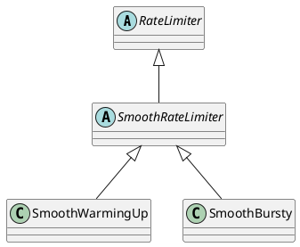

com.google.common.util.concurrent.RateLimiter
- RateLimiter使用的是一种叫**令牌桶**的流控算法，RateLimiter会按照一定的频率往桶里扔令牌，线程拿到令牌才能执行
- RateLimiter经常用于限制对一些物理资源或者逻辑资源的访问速率。与Semaphore 相比，Semaphore 限制了并发访问的数量而不是使用速率。
- SmoothBursty 平滑突发限流
- SmoothWarmingUp 平滑预热限流，系统冷启动后慢慢趋于平均速率

## Hierarchy
```
RateLimiter (com.google.common.util.concurrent)
    SmoothRateLimiter (com.google.common.util.concurrent)
        SmoothWarmingUp in SmoothRateLimiter (com.google.common.util.concurrent) 平滑预热限流
        SmoothBursty in SmoothRateLimiter (com.google.common.util.concurrent) 平滑突发限流
```

## Define
