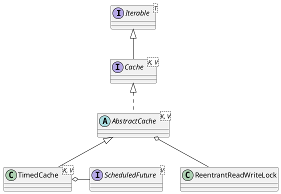

cn.hutool.cache.impl.TimedCache

## hierarchy
```
AbstractCache (cn.hutool.cache.impl)
    TimedCache (cn.hutool.cache.impl)
        WeakCache (cn.hutool.cache.impl)
```
## define

```plantuml
@startuml

interface Iterable<T>
interface Cache<K, V>
Iterable ^-- Cache

abstract class AbstractCache<K, V>
class TimedCache<K, V>

Cache ^.. AbstractCache 
AbstractCache ^-- TimedCache
AbstractCache o-- ReentrantReadWriteLock

interface ScheduledFuture<V>
TimedCache o- ScheduledFuture

@enduml
```
