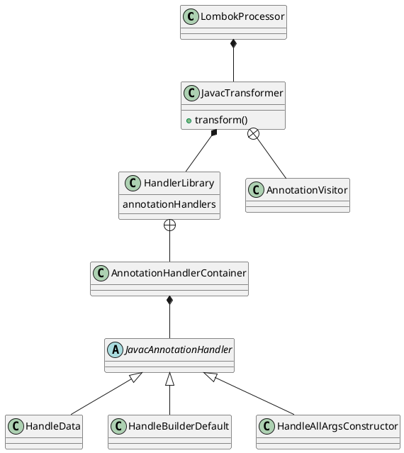
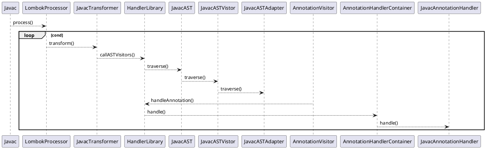

### class

```plantuml
@startuml

class LombokProcessor

LombokProcessor *-- JavacTransformer

class JavacTransformer {
  + transform()
}
class HandlerLibrary {
  annotationHandlers
}

JavacTransformer *-- HandlerLibrary
JavacTransformer +-- AnnotationVisitor

HandlerLibrary +-- AnnotationHandlerContainer

AnnotationHandlerContainer *-- JavacAnnotationHandler

abstract class JavacAnnotationHandler
JavacAnnotationHandler ^-- HandleData
JavacAnnotationHandler ^-- HandleBuilderDefault
JavacAnnotationHandler ^-- HandleAllArgsConstructor

@enduml
```

### sequence

```plantuml
@startuml

Javac --> LombokProcessor : process()

loop cond
  LombokProcessor --> JavacTransformer : transform()
  JavacTransformer --> HandlerLibrary : callASTVisitors()

  HandlerLibrary --> JavacAST : traverse()
  JavacAST --> JavacASTVistor : traverse()
  JavacASTVistor --> JavacASTAdapter : traverse()

  AnnotationVisitor --> HandlerLibrary : handleAnnotation()
  HandlerLibrary --> AnnotationHandlerContainer : handle()
  AnnotationHandlerContainer --> JavacAnnotationHandler : handle()
end


@enduml
```