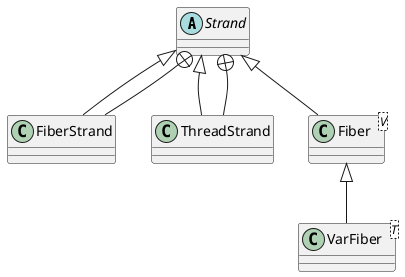

co.paralleluniverse.strands.Strand

## hierarchy
```
Strand (co.paralleluniverse.strands)
    Fiber (co.paralleluniverse.fibers)
        VarFiber in Var (co.paralleluniverse.strands.dataflow)
    FiberStrand in Strand (co.paralleluniverse.strands)
    ThreadStrand in Strand (co.paralleluniverse.strands)
```

## define
