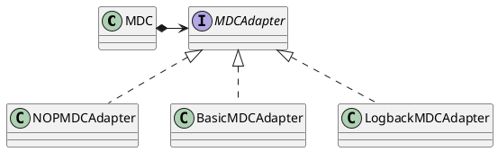

org.slf4j.MDC
org.slf4j.spi.MDCAdapter

MDC(Mapped Diagnostic Context)诊断上下文映射
## ## Hierarchy
```
MDCAdapter (org.slf4j.spi)
    NOPMDCAdapter (org.slf4j.helpers)
    BasicMDCAdapter (org.slf4j.helpers)
    LogbackMDCAdapter (ch.qos.logback.classic.util)
```

## Define
