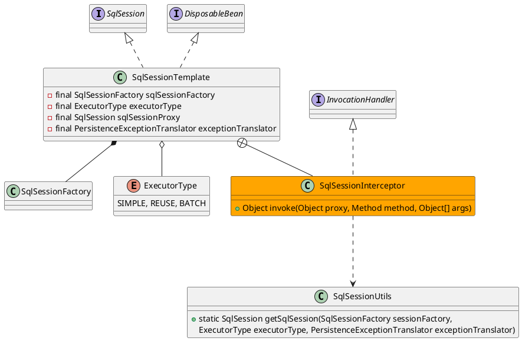

org.mybatis.spring.SqlSessionTemplate

## define
线程安全的、spring事务管理的

* 内部类
  * SqlSessionInterceptor 会话拦截器
* 实例域
  * sqlSessionFactory 需要SqlSessionFactory生产会话
  * PersistenceExceptionTranslator 将mybatis持久层异常转换成未检查的数据访问层异常
  * sqlSessionProxy 使用会话代理
* 实例方法



## methods

### 构造方法
```java
public SqlSessionTemplate(SqlSessionFactory sqlSessionFactory, ExecutorType executorType,
      PersistenceExceptionTranslator exceptionTranslator) {

    notNull(sqlSessionFactory, "Property 'sqlSessionFactory' is required");
    notNull(executorType, "Property 'executorType' is required");

    this.sqlSessionFactory = sqlSessionFactory;
    this.executorType = executorType;
    this.exceptionTranslator = exceptionTranslator;
    this.sqlSessionProxy = (SqlSession) newProxyInstance(
        SqlSessionFactory.class.getClassLoader(),
        new Class[] { SqlSession.class },
        new SqlSessionInterceptor());
  }
```

## innerClass

### SqlSessionInterceptor
- getSqlSession
- method.invoke
  - sqlSession.commit
  - translateExceptionIfPossible
- closeSqlSession

```java
  private class SqlSessionInterceptor implements InvocationHandler {
    @Override
    public Object invoke(Object proxy, Method method, Object[] args) throws Throwable {
      SqlSession sqlSession = getSqlSession(
          SqlSessionTemplate.this.sqlSessionFactory,
          SqlSessionTemplate.this.executorType,
          SqlSessionTemplate.this.exceptionTranslator);
      try {
        Object result = method.invoke(sqlSession, args);
        if (!isSqlSessionTransactional(sqlSession, SqlSessionTemplate.this.sqlSessionFactory)) {
          // force commit even on non-dirty sessions because some databases require
          // a commit/rollback before calling close()
          sqlSession.commit(true);
        }
        return result;
      } catch (Throwable t) {
        Throwable unwrapped = unwrapThrowable(t);
        if (SqlSessionTemplate.this.exceptionTranslator != null && unwrapped instanceof PersistenceException) {
          // release the connection to avoid a deadlock if the translator is no loaded. See issue #22
          closeSqlSession(sqlSession, SqlSessionTemplate.this.sqlSessionFactory);
          sqlSession = null;
          Throwable translated = SqlSessionTemplate.this.exceptionTranslator.translateExceptionIfPossible((PersistenceException) unwrapped);
          if (translated != null) {
            unwrapped = translated;
          }
        }
        throw unwrapped;
      } finally {
        if (sqlSession != null) {
          closeSqlSession(sqlSession, SqlSessionTemplate.this.sqlSessionFactory);
        }
      }
    }
  }
```

## stack

```
// spring-mybatis
invoke:433, SqlSessionTemplate$SqlSessionInterceptor (org.mybatis.spring)
selectList:-1, $Proxy91 (com.sun.proxy)  jdk动态代理
selectList:230, SqlSessionTemplate (org.mybatis.spring)

// MapperMethod
executeForMany:137, MapperMethod (org.apache.ibatis.binding)
execute:75, MapperMethod (org.apache.ibatis.binding)

// MapperProxy
invoke:59, MapperProxy (org.apache.ibatis.binding) 实现了 InvocationHandler.invoke
selectList:-1, $Proxy92 (com.sun.proxy)  jdk动态代理
```