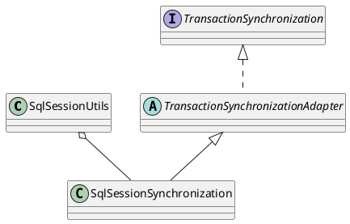

org.mybatis.spring.SqlSessionUtils

## define



## methods

### getSqlSession
```java
  public static SqlSession getSqlSession(SqlSessionFactory sessionFactory, ExecutorType executorType, PersistenceExceptionTranslator exceptionTranslator) {

    notNull(sessionFactory, NO_SQL_SESSION_FACTORY_SPECIFIED);
    notNull(executorType, NO_EXECUTOR_TYPE_SPECIFIED);

    // 从Spring事务管理器中获取SqlSessionHolder，其中封装了SqlSession对象
    SqlSessionHolder holder = (SqlSessionHolder) TransactionSynchronizationManager.getResource(sessionFactory);

    // 获取SqlSessionHolder中封装的SqlSession对象
    SqlSession session = sessionHolder(executorType, holder);
    if (session != null) {
      return session;
    }

    if (LOGGER.isDebugEnabled()) {
      LOGGER.debug("Creating a new SqlSession");
    }

    session = sessionFactory.openSession(executorType);
    // 将SqlSession对象与Spring事务管理器绑定
    registerSessionHolder(sessionFactory, executorType, exceptionTranslator, session);

    return session;
  }
```