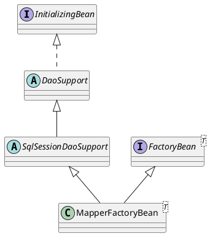

org.mybatis.spring.mapper.MapperFactoryBean

## package
```
DaoSupport (org.springframework.dao.support)
    SqlSessionDaoSupport (org.mybatis.spring.support)
        MapperFactoryBean (org.mybatis.spring.mapper)
```

## define


```java
public class MapperFactoryBean<T> extends SqlSessionDaoSupport implements FactoryBean<T> {
  private Class<T> mapperInterface;
  private boolean addToConfig = true;
  
  @Override
  public T getObject() throws Exception {
    return getSqlSession().getMapper(this.mapperInterface);
  }

  @Override
  public Class<T> getObjectType() {
    return this.mapperInterface;
  }

  @Override
  public boolean isSingleton() {
    return true;
  }
}
```