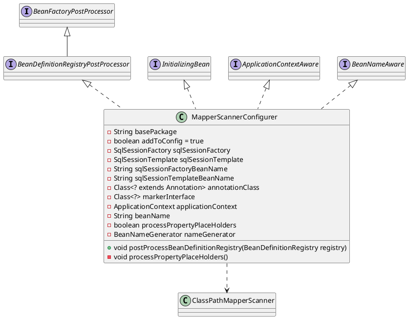

org.mybatis.spring.mapper.MapperScannerConfigurer

* MapperScannerConfigurer
* ClassPathMapperScanner

## hierarchy
```
MapperScannerConfigurer (org.mybatis.spring.mapper)
    Object (java.lang)
    BeanDefinitionRegistryPostProcessor (org.springframework.beans.factory.support)
        BeanFactoryPostProcessor (org.springframework.beans.factory.config)
    InitializingBean (org.springframework.beans.factory)
    ApplicationContextAware (org.springframework.context)
        Aware (org.springframework.beans.factory)
    BeanNameAware (org.springframework.beans.factory)
        Aware (org.springframework.beans.factory)
```

## define


## methods
```java

 public void postProcessBeanDefinitionRegistry(BeanDefinitionRegistry registry) {
    if (this.processPropertyPlaceHolders) {
      processPropertyPlaceHolders();
    }

    ClassPathMapperScanner scanner = new ClassPathMapperScanner(registry);
    scanner.setAddToConfig(this.addToConfig);
    scanner.setAnnotationClass(this.annotationClass);
    scanner.setMarkerInterface(this.markerInterface);
    scanner.setSqlSessionFactory(this.sqlSessionFactory);
    scanner.setSqlSessionTemplate(this.sqlSessionTemplate);
    scanner.setSqlSessionFactoryBeanName(this.sqlSessionFactoryBeanName);
    scanner.setSqlSessionTemplateBeanName(this.sqlSessionTemplateBeanName);
    scanner.setResourceLoader(this.applicationContext);
    scanner.setBeanNameGenerator(this.nameGenerator);
    scanner.registerFilters();
    scanner.scan(StringUtils.tokenizeToStringArray(this.basePackage, ConfigurableApplicationContext.CONFIG_LOCATION_DELIMITERS));
  }

  /*
   * BeanDefinitionRegistries are called early in application startup, before
   * BeanFactoryPostProcessors. This means that PropertyResourceConfigurers will not have been
   * loaded and any property substitution of this class' properties will fail. To avoid this, find
   * any PropertyResourceConfigurers defined in the context and run them on this class' bean
   * definition. Then update the values.
   */
  private void processPropertyPlaceHolders() {
    Map<String, PropertyResourceConfigurer> prcs = applicationContext.getBeansOfType(PropertyResourceConfigurer.class);

    if (!prcs.isEmpty() && applicationContext instanceof ConfigurableApplicationContext) {
      BeanDefinition mapperScannerBean = ((ConfigurableApplicationContext) applicationContext)
          .getBeanFactory().getBeanDefinition(beanName);

      // PropertyResourceConfigurer does not expose any methods to explicitly perform
      // property placeholder substitution. Instead, create a BeanFactory that just
      // contains this mapper scanner and post process the factory.
      DefaultListableBeanFactory factory = new DefaultListableBeanFactory();
      factory.registerBeanDefinition(beanName, mapperScannerBean);

      for (PropertyResourceConfigurer prc : prcs.values()) {
        prc.postProcessBeanFactory(factory);
      }

      PropertyValues values = mapperScannerBean.getPropertyValues();

      this.basePackage = updatePropertyValue("basePackage", values);
      this.sqlSessionFactoryBeanName = updatePropertyValue("sqlSessionFactoryBeanName", values);
      this.sqlSessionTemplateBeanName = updatePropertyValue("sqlSessionTemplateBeanName", values);
    }
  }

```

## invoke
```

// postProcessBeanDefinitionRegistry
postProcessBeanDefinitionRegistry:302, MapperScannerConfigurer (org.mybatis.spring.mapper)

// invokeBeanFactoryPostProcessors 调用bean工厂后处理器
invokeBeanFactoryPostProcessors:123, PostProcessorRegistrationDelegate (org.springframework.context.support)
invokeBeanFactoryPostProcessors:678, AbstractApplicationContext (org.springframework.context.support)

// refresh
refresh:520, AbstractApplicationContext (org.springframework.context.support)
configureAndRefreshWebApplicationContext:444, ContextLoader (org.springframework.web.context)
initWebApplicationContext:326, ContextLoader (org.springframework.web.context)
contextInitialized:107, ContextLoaderListener (org.springframework.web.context)

listenerStart:5099, StandardContext (org.apache.catalina.core)
startInternal:5615, StandardContext (org.apache.catalina.core)
start:147, LifecycleBase (org.apache.catalina.util)

addChildInternal:899, ContainerBase (org.apache.catalina.core)
addChild:875, ContainerBase (org.apache.catalina.core)
addChild:652, StandardHost (org.apache.catalina.core)
manageApp:1863, HostConfig (org.apache.catalina.startup)
invoke0:-1, NativeMethodAccessorImpl (sun.reflect)
invoke:57, NativeMethodAccessorImpl (sun.reflect)
invoke:43, DelegatingMethodAccessorImpl (sun.reflect)
invoke:606, Method (java.lang.reflect)
invoke:301, BaseModelMBean (org.apache.tomcat.util.modeler)
invoke:819, DefaultMBeanServerInterceptor (com.sun.jmx.interceptor)
invoke:801, JmxMBeanServer (com.sun.jmx.mbeanserver)
createStandardContext:618, MBeanFactory (org.apache.catalina.mbeans)
createStandardContext:565, MBeanFactory (org.apache.catalina.mbeans)

invoke0:-1, NativeMethodAccessorImpl (sun.reflect)
invoke:57, NativeMethodAccessorImpl (sun.reflect)
invoke:43, DelegatingMethodAccessorImpl (sun.reflect)
invoke:606, Method (java.lang.reflect)
invoke:301, BaseModelMBean (org.apache.tomcat.util.modeler)
invoke:819, DefaultMBeanServerInterceptor (com.sun.jmx.interceptor)
invoke:801, JmxMBeanServer (com.sun.jmx.mbeanserver)
doOperation:1487, RMIConnectionImpl (javax.management.remote.rmi)
access$300:97, RMIConnectionImpl (javax.management.remote.rmi)
run:1328, RMIConnectionImpl$PrivilegedOperation (javax.management.remote.rmi)
doPrivilegedOperation:1420, RMIConnectionImpl (javax.management.remote.rmi)
invoke:848, RMIConnectionImpl (javax.management.remote.rmi)
invoke0:-1, NativeMethodAccessorImpl (sun.reflect)
invoke:57, NativeMethodAccessorImpl (sun.reflect)
invoke:43, DelegatingMethodAccessorImpl (sun.reflect)
invoke:606, Method (java.lang.reflect)
dispatch:322, UnicastServerRef (sun.rmi.server)
run:202, Transport$2 (sun.rmi.transport)
run:199, Transport$2 (sun.rmi.transport)
doPrivileged:-1, AccessController (java.security)
serviceCall:198, Transport (sun.rmi.transport)
handleMessages:567, TCPTransport (sun.rmi.transport.tcp)
run0:828, TCPTransport$ConnectionHandler (sun.rmi.transport.tcp)
access$400:619, TCPTransport$ConnectionHandler (sun.rmi.transport.tcp)
run:684, TCPTransport$ConnectionHandler$1 (sun.rmi.transport.tcp)
run:681, TCPTransport$ConnectionHandler$1 (sun.rmi.transport.tcp)
doPrivileged:-1, AccessController (java.security)
run:681, TCPTransport$ConnectionHandler (sun.rmi.transport.tcp)
runWorker:1145, ThreadPoolExecutor (java.util.concurrent)
run:615, ThreadPoolExecutor$Worker (java.util.concurrent)
run:745, Thread (java.lang)
```