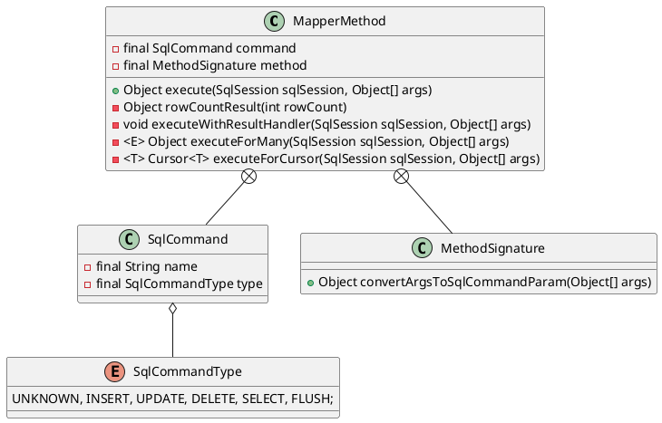

org.apache.ibatis.binding.MapperMethod

## define
* 内部类
  * ParamMap
  * SqlCommand
  * MethodSignature
* 实例域
* 实例方法
  * execute 根据sql命令类型调用不同的方法
    * rowCountResult
    * executeWithResultHandler
    * executeForMany
    * executeForCursor


## methods
## #execute()
* 根据command类型判断 增删改查、刷新
  - INSERT
  - UPDATE
  - DELETE
  - SELECT
    - returnsMany
    - returnsMap
    - returnsCursor
    - selectOne
  - FLUSH
* rowCountResult 受影响的行数（增、删、改）

```java
  public Object execute(SqlSession sqlSession, Object[] args) {
    Object result;
    switch (command.getType()) {
      case INSERT: {
    	Object param = method.convertArgsToSqlCommandParam(args);
        result = rowCountResult(sqlSession.insert(command.getName(), param));
        break;
      }
      case UPDATE: {
        Object param = method.convertArgsToSqlCommandParam(args);
        result = rowCountResult(sqlSession.update(command.getName(), param));
        break;
      }
      case DELETE: {
        Object param = method.convertArgsToSqlCommandParam(args);
        result = rowCountResult(sqlSession.delete(command.getName(), param));
        break;
      }
      case SELECT:
        if (method.returnsVoid() && method.hasResultHandler()) {
          executeWithResultHandler(sqlSession, args);
          result = null;
        } else if (method.returnsMany()) {
          result = executeForMany(sqlSession, args);
        } else if (method.returnsMap()) {
          result = executeForMap(sqlSession, args);
        } else if (method.returnsCursor()) {
          result = executeForCursor(sqlSession, args);
        } else {
          Object param = method.convertArgsToSqlCommandParam(args);
          result = sqlSession.selectOne(command.getName(), param);
        }
        break;
      case FLUSH:
        result = sqlSession.flushStatements();
        break;
      default:
        throw new BindingException("Unknown execution method for: " + command.getName());
    }
    if (result == null && method.getReturnType().isPrimitive() && !method.returnsVoid()) {
      throw new BindingException("Mapper method '" + command.getName() 
          + " attempted to return null from a method with a primitive return type (" + method.getReturnType() + ").");
    }
    return result;
  }
  
```