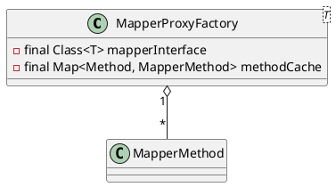

org.apache.ibatis.binding.MapperProxyFactory

## define

```plantuml
@startuml

class MapperProxyFactory<T> {
    - final Class<T> mapperInterface
    - final Map<Method, MapperMethod> methodCache
}

MapperProxyFactory "1" o-- "*"  MapperMethod

@enduml
```
