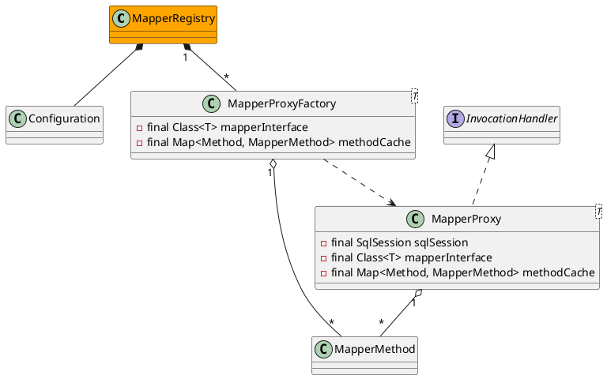

org.apache.ibatis.binding.MapperRegistry

## define

```plantuml
@startuml

'''''''''''''''''''''MapperRegistry'''''''''''''''''''''
class MapperRegistry #orange
MapperRegistry *-- Configuration
MapperRegistry "1" *-- "*" MapperProxyFactory

'''''''''''''''''''''MapperProxyFactory'''''''''''''''''''''
class MapperProxyFactory<T> {
    - final Class<T> mapperInterface
    - final Map<Method, MapperMethod> methodCache
}
MapperProxyFactory "1" o-- "*" MapperMethod
MapperProxyFactory ..> MapperProxy

'''''''''''''''''''''MapperProxy'''''''''''''''''''''
class MapperProxy<T> {
    - final SqlSession sqlSession
    - final Class<T> mapperInterface
    - final Map<Method, MapperMethod> methodCache
}
MapperProxy "1" o-- "*" MapperMethod
interface InvocationHandler
InvocationHandler ^.. MapperProxy

@enduml
```